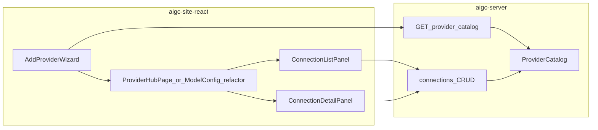

# Cherry「其他服务商 / ProviderList」能力移植到 AIGCmanju

## 源码事实（Cherry）

- 文案「选择其他服务商」出现在引导页 `[WelcomePage.tsx](file:///Users/xingyi/Downloads/cherry-studio-1.8.3/src/renderer/src/pages/onboarding/components/WelcomePage.tsx)`：点击后 `[ProviderPopup.show()](file:///Users/xingyi/Downloads/cherry-studio-1.8.3/src/renderer/src/pages/onboarding/components/ProviderPopup.tsx)`。
- `ProviderPopup` 内嵌 **完整** `[ProviderList](file:///Users/xingyi/Downloads/cherry-studio-1.8.3/src/renderer/src/pages/settings/ProviderSettings/ProviderList.tsx)` + `MemoryRouter`，右侧详情为 `[ProviderSetting](file:///Users/xingyi/Downloads/cherry-studio-1.8.3/src/renderer/src/pages/settings/ProviderSettings/ProviderSetting.tsx)`（依赖 `useProvider`、Redux、`window.api`、按 `ProviderType` 分支的 Anthropic/Vertex/Bedrock/OVMS 等大量子组件）。

## AIGC 侧现状

- 数据模型：`[ConnectionConfig](file:///Users/xingyi/Downloads/AIGCmanju_副本/aigc-site-react/src/types/index.ts)` + `[ModelConfig](file:///Users/xingyi/Downloads/AIGCmanju_副本/aigc-site-react/src/types/index.ts)`，REST 已在 `[ConnectionConfigController](file:///Users/xingyi/Downloads/AIGCmanju_副本/aigc-server/src/main/java/com/example/aigc/controller/ConnectionConfigController.java)`。
- 后端**允许的提供商**由 `[ProviderCatalog](file:///Users/xingyi/Downloads/AIGCmanju_副本/aigc-server/src/main/java/com/example/aigc/service/ProviderCatalog.java)` 注册表决定（`require()` 校验），与 Cherry 的「上百个系统 Provider + 自定义」不是同一套数据模型。
- 前端 `[ModelConfigPage](file:///Users/xingyi/Downloads/AIGCmanju_副本/aigc-site-react/src/pages/ModelConfigPage.tsx)` 已是「快捷 / 高级 + 连接表 + 模型表」，但**不是** Cherry 的左右分栏「服务商列表 + 单服务商深度设置」布局。

## 结论：可交付范围

| 维度                                                  | 是否 1:1 复制 Cherry                                                                                                                                                                                      |
| --------------------------------------------------- | ----------------------------------------------------------------------------------------------------------------------------------------------------------------------------------------------------- |
| 布局与主流程（列表选连接 → 右侧编辑连接与模型、添加服务商向导）                   | **可对齐实现**（在 AIGC 组件内重写，不拷贝 Cherry 源码以避免许可证与依赖爆炸）                                                                                                                                                      |
| Cherry 的 ProviderType 全量专用设置（Vertex/Bedrock/OVMS/…） | **不可移植**，除非在 AIGC 后端与网关中逐项实现对应协议                                                                                                                                                                      |
| 与 Cherry 相同数量的「系统服务商」                               | **不对齐**；以 AIGC `ProviderCatalog` 为准，后续扩展需改 Java 注册表与 `[ProviderHttpGateway](file:///Users/xingyi/Downloads/AIGCmanju_副本/aigc-server/src/main/java/com/example/aigc/service/ProviderHttpGateway.java)` |

## 架构（目标形态）

## 实现步骤

### 1. 后端：暴露「可选服务商目录」

- 新增只读接口，例如 `GET /api/v1/provider-catalog`，返回 `ProviderCatalog.list()` 的安全子集：`key`、`displayName`、`defaultBaseUrl`、`authMode`、`apiFormat`、是否支持文本/图片/视频代理等（字段以现有 `ProviderDefinition` record 为准，避免泄露内部路径细节以外的敏感信息）。
- 新增 DTO + Controller，复用现有 `[ProviderCatalog#list()](file:///Users/xingyi/Downloads/AIGCmanju_副本/aigc-server/src/main/java/com/example/aigc/service/ProviderCatalog.java)`。

### 2. 前端：服务商中心 UI（Cherry ProviderList 体验）

- 在 `[aigc-site-react](file:///Users/xingyi/Downloads/AIGCmanju_副本/aigc-site-react)` 增加「服务商中心」视图（二选一，按实现成本定）：
  - **方案 A**：新页面 `[ProviderHubPage.tsx](file:///Users/xingyi/Downloads/AIGCmanju_副本/aigc-site-react/src/pages/ProviderHubPage.tsx)` + 路由（如 `/models/hub`），原 `[ModelConfigPage](file:///Users/xingyi/Downloads/AIGCmanju_副本/aigc-site-react/src/pages/ModelConfigPage.tsx)` 保留快捷模式入口或重定向。
  - **方案 B**：重构 `ModelConfigPage` 高级模式为左右分栏，与快捷模式并存。
- 组件拆分建议：
  - **左侧**：连接列表（搜索、选中高亮、新建）——数据仍来自现有 `getConnections()`。
  - **右侧**：选中连接的详情：展示/编辑连接（复用 `[ConnectionForm](file:///Users/xingyi/Downloads/AIGCmanju_副本/aigc-site-react/src/components/model/ConnectionForm.tsx)` 逻辑，可抽成非 Modal 的 `ConnectionEditor`）+ 该连接下模型列表（复用 `[ModelForm](file:///Users/xingyi/Downloads/AIGCmanju_副本/aigc-site-react/src/components/model/ModelForm.tsx)` / 表格）。
  - **添加服务商**：模态向导——从 `provider-catalog` 选 `key` → 自动填充 `defaultBaseUrl` → 用户填名称与 API Key → `createConnection`（`provider` 传 catalog `key`）。

### 3. 「选择其他服务商」入口对齐 Cherry

- `[HomePage](file:///Users/xingyi/Downloads/AIGCmanju_副本/aigc-site-react/src/pages/HomePage.tsx)` / `[HeroSection](file:///Users/xingyi/Downloads/AIGCmanju_副本/aigc-site-react/src/components/home/HeroSection.tsx)`：在「开始创作」旁增加次要按钮「选择其他服务商」→ `navigate('/models/hub')`（或带 query 打开添加向导）。
- `[QuickModelForm](file:///Users/xingyi/Downloads/AIGCmanju_副本/aigc-site-react/src/components/model/QuickModelForm.tsx)`：分隔线 + 「选择其他服务商」→ 关闭并跳转服务商中心（或打开 `AddProviderWizard`）。顺带修复当前「切换到高级模式」仅 `onClose`、未真正切换模式的问题（通过 `navigate` + `useSearchParams` 约定 `mode=advanced` 或 `view=hub`）。

### 4. API 与类型

- `[aigc-site-react/src/api](file:///Users/xingyi/Downloads/AIGCmanju_副本/aigc-site-react/src/api)` 增加 `getProviderCatalog()`；`[types](file:///Users/xingyi/Downloads/AIGCmanju_副本/aigc-site-react/src/types/index.ts)` 增加 `ProviderCatalogEntry` 等。

### 5. 明确不做的部分（除非另开需求）

- 不移植 Cherry 的 `ProviderLogoPicker` / ImageStorage、拖拽排序、OVMS/Copilot/OAuth 等 Electron 能力。
- 不在本阶段扩展 AIGC `ProviderCatalog` 到 Cherry 的几十种网关；若需某一类（如 New API），应单独提需求：Java 注册 + 网关路径 + 前端展示。

## 风险与依赖

- **一致性**：连接 `provider` 字段必须与 `ProviderCatalog` 的 `key`/别名匹配（现有 `[ConnectionConfigService](file:///Users/xingyi/Downloads/AIGCmanju_副本/aigc-server/src/main/java/com/example/aigc/service/ConnectionConfigService.java)` 已 `require`）；向导必须从目录选择，避免手输错误。
- **工作量**：Cherry 单文件 `ProviderList` 约 500+ 行且依赖众多；AIGC 实现应控制为「分栏 + 向导 + 复用现有表单」，避免重写 Cherry 级子设置页。

