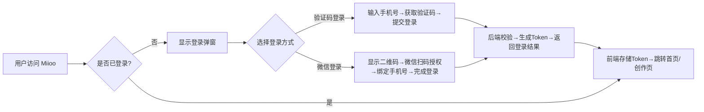
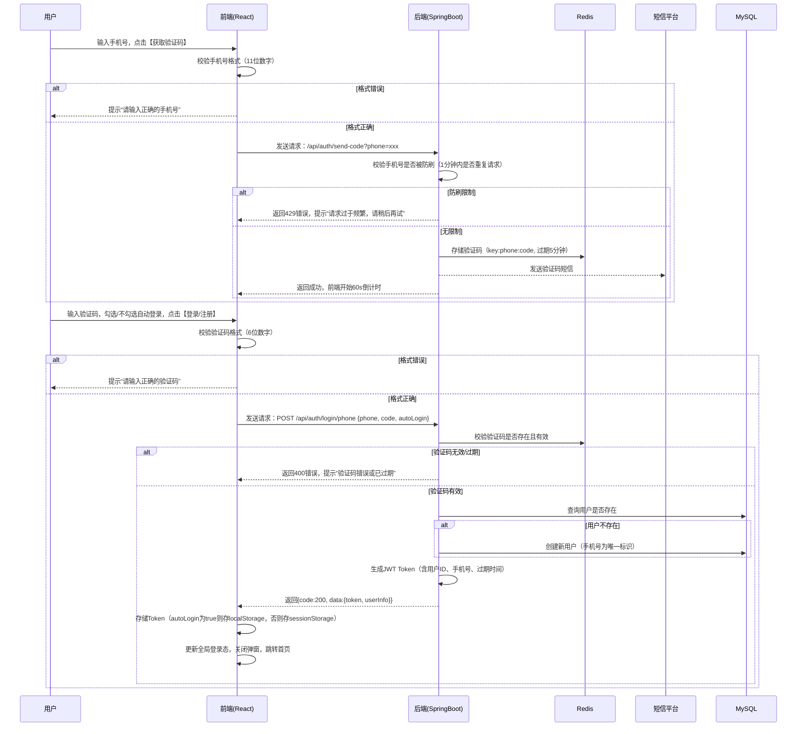
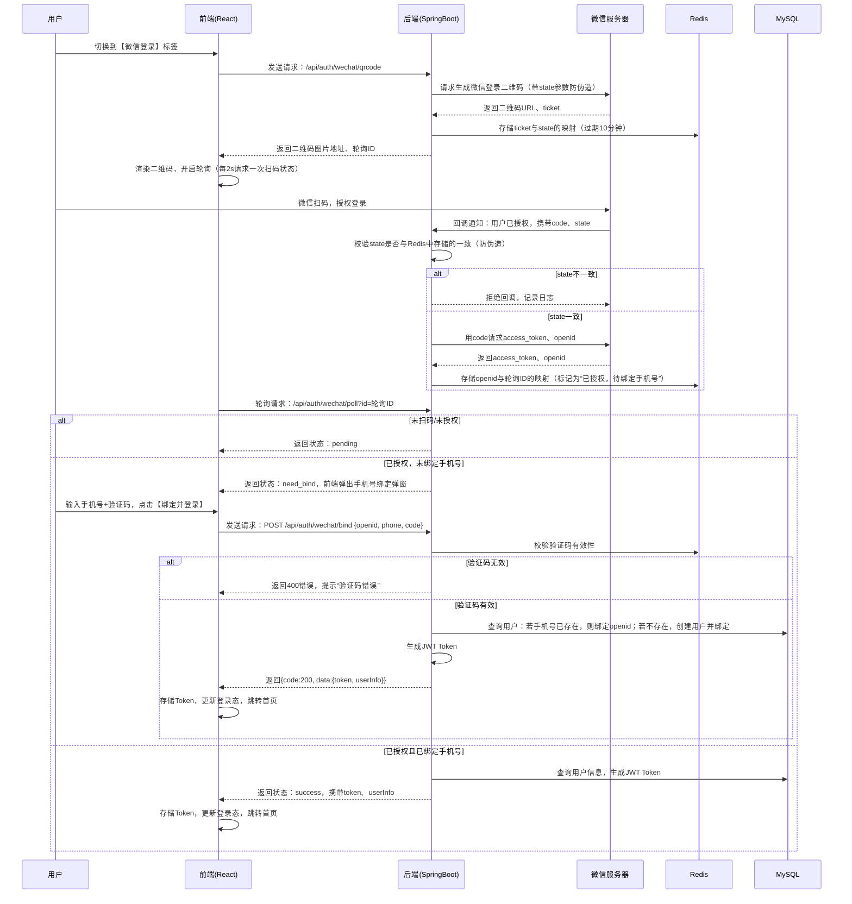

# Miioo 登录模块开发文档（React + SpringBoot）

本文档将围绕 Miioo 平台的登录模块，从需求分析、概要设计到详细设计进行完整梳理，为前后端开发提供清晰的交互逻辑与实现规范。

---

## 一、需求分析

### 1.1 功能需求

|场景|功能描述|优先级|
|---|---|---|
|验证码登录|用户输入手机号，获取并填写验证码后完成登录/注册|高|
|微信扫码登录|用户通过微信扫码，授权后绑定手机号完成登录|高|
|自动登录|勾选“下次自动登录”，生成长效 Token，下次访问免登录|中|
|协议确认|登录时需明确提示用户同意《用户协议》与《隐私政策》|高|
|登录态保持|登录成功后，前端维护 Token，后端校验会话有效性|高|
|登录失败处理|手机号/验证码错误、Token 过期、微信授权失败等场景的错误提示|高|
### 1.2 非功能需求

- **安全性**：验证码防刷、Token 防篡改、微信登录回调防伪造、手机号脱敏展示

- **易用性**：表单实时校验、验证码倒计时、错误信息友好提示、微信扫码引导清晰

- **兼容性**：适配主流浏览器（Chrome、Edge、Safari），响应式布局适配不同分辨率

- **可扩展性**：后续支持第三方登录（QQ/钉钉）、单点登录等扩展场景

---

## 二、概要设计

### 2.1 整体交互流程


### 2.2 前后端角色分工

|角色|核心职责|
|---|---|
|前端（React）|1. 登录表单渲染与校验；2. 验证码倒计时、微信二维码轮询状态；3. Token 存储与请求携带；4. 错误提示与用户引导；5. 路由守卫控制未登录访问|
|后端（SpringBoot）|1. 手机号/验证码校验；2. 微信 OAuth2 授权回调处理；3. 用户信息创建/查询；4. Token 生成与有效性校验；5. 防刷与安全策略实现|
### 2.3 技术选型

|层级|技术栈|说明|
|---|---|---|
|前端|React + TypeScript|组件化开发，类型安全，便于维护|
|状态管理|React Context / Redux|维护全局登录态、用户信息|
|表单校验|Ant Design Form / React Hook Form|手机号、验证码格式校验|
|后端|SpringBoot 2.x/3.x|快速开发 RESTful 接口|
|安全框架|Spring Security + JWT|实现 Token 认证与权限控制|
|缓存|Redis|存储验证码、微信登录状态，设置过期时间|
|数据库|MySQL|存储用户信息、绑定关系|
---

## 三、详细设计

### 3.1 前端详细设计

#### 3.1.1 页面结构与组件划分

```Plain Text

src/
├── components/
│   └── LoginModal/          # 登录弹窗组件
│       ├── PhoneLogin.tsx   # 验证码登录子组件
│       ├── WechatLogin.tsx  # 微信登录子组件
│       └── index.tsx        # 父组件，控制登录方式切换
├── context/
│   └── AuthContext.tsx      # 登录态全局上下文
├── hooks/
│   ├── useLogin.ts          # 登录逻辑自定义Hook
│   └── useWechatLogin.ts    # 微信登录逻辑Hook
├── services/
│   └── authApi.ts           # 登录相关API请求封装
└── utils/
    ├── token.ts             # Token存储/读取工具
    └── validator.ts         # 表单校验工具
```

#### 3.1.2 核心交互逻辑

##### 1. 验证码登录流程


##### 2. 微信扫码登录流程


#### 3.1.3 核心代码示例

1. 表单校验与验证码倒计时

```TypeScript

// PhoneLogin.tsx
import { useState, useEffect } from 'react';
import { Form, Input, Button, Checkbox, message } from 'antd';
import { sendCodeApi, phoneLoginApi } from '@/services/authApi';
import { useAuth } from '@/context/AuthContext';

const PhoneLogin = () => {
  const [form] = Form.useForm();
  const [countdown, setCountdown] = useState(0);
  const [loading, setLoading] = useState(false);
  const { login } = useAuth();

  // 验证码倒计时
  useEffect(() => {
    if (countdown > 0) {
      const timer = setTimeout(() => setCountdown(countdown - 1), 1000);
      return () => clearTimeout(timer);
    }
  }, [countdown]);

  // 获取验证码
  const handleSendCode = async () => {
    const phone = form.getFieldValue('phone');
    if (!/^1[3-9]\d{9}$/.test(phone)) {
      message.error('请输入正确的手机号');
      return;
    }
    try {
      await sendCodeApi(phone);
      setCountdown(60);
      message.success('验证码已发送');
    } catch (err: any) {
      message.error(err.response?.data?.msg || '发送失败，请稍后再试');
    }
  };

  // 提交登录
  const handleSubmit = async (values: any) => {
    setLoading(true);
    try {
      const res = await phoneLoginApi({
        phone: values.phone,
        code: values.code,
        autoLogin: values.autoLogin
      });
      login(res.data.token, res.data.userInfo, values.autoLogin);
      message.success('登录成功');
    } catch (err: any) {
      message.error(err.response?.data?.msg || '登录失败');
    } finally {
      setLoading(false);
    }
  };

  return (
    <Form form={form} onFinish={handleSubmit} layout="vertical">
      <Form.Item name="phone" rules={[{ required: true, pattern: /^1[3-9]\d{9}$/, message: '请输入正确的手机号' }]}>
        <Input placeholder="手机号" />
      </Form.Item>
      <Form.Item name="code" rules={[{ required: true, len: 6, message: '请输入6位验证码' }]}>
        <Input placeholder="验证码" suffix={
          <Button type="link" onClick={handleSendCode} disabled={countdown > 0}>
            {countdown > 0 ? `${countdown}s后重发` : '获取验证码'}
          </Button>
        } />
      </Form.Item>
      <Form.Item name="autoLogin" valuePropName="checked">
        <Checkbox>下次自动登录</Checkbox>
      </Form.Item>
      <Button type="primary" htmlType="submit" loading={loading} block>
        登录/注册
      </Button>
      <div style={{ marginTop: 16, fontSize: 12, color: '#666' }}>
        登录即表示您同意并遵守《用户协议》与《隐私政策》
      </div>
    </Form>
  );
};

export default PhoneLogin;
```

1. 微信登录二维码轮询

```TypeScript

// WechatLogin.tsx
import { useState, useEffect } from 'react';
import { message } from 'antd';
import { getWechatQrcodeApi, pollWechatStatusApi } from '@/services/authApi';
import { useAuth } from '@/context/AuthContext';
import BindPhoneModal from './BindPhoneModal';

const WechatLogin = () => {
  const [qrcodeUrl, setQrcodeUrl] = useState('');
  const [pollId, setPollId] = useState('');
  const [showBindModal, setShowBindModal] = useState(false);
  const [openid, setOpenid] = useState('');
  const { login } = useAuth();

  // 获取二维码
  const fetchQrcode = async () => {
    try {
      const res = await getWechatQrcodeApi();
      setQrcodeUrl(res.data.qrcodeUrl);
      setPollId(res.data.pollId);
    } catch (err) {
      message.error('获取二维码失败，请刷新重试');
    }
  };

  // 轮询扫码状态
  useEffect(() => {
    if (!pollId) return;
    const timer = setInterval(async () => {
      try {
        const res = await pollWechatStatusApi(pollId);
        if (res.data.status === 'success') {
          clearInterval(timer);
          login(res.data.token, res.data.userInfo, true);
          message.success('登录成功');
        } else if (res.data.status === 'need_bind') {
          clearInterval(timer);
          setOpenid(res.data.openid);
          setShowBindModal(true);
        }
      } catch (err) {
        console.error('轮询失败', err);
      }
    }, 2000);

    return () => clearInterval(timer);
  }, [pollId]);

  useEffect(() => {
    fetchQrcode();
  }, []);

  return (
    <div style={{ textAlign: 'center' }}>
      {qrcodeUrl ? (
        <>
          
          <p style={{ marginTop: 16, fontSize: 12, color: '#666' }}>请使用微信扫码并在公众号内确认登录</p>
        </>
      ) : (
        <div style={{ width: 200, height: 200, display: 'flex', alignItems: 'center', justifyContent: 'center' }}>加载中...</div>
      )}
      <BindPhoneModal
        visible={showBindModal}
        openid={openid}
        onSuccess={(token, userInfo) => {
          login(token, userInfo, true);
          setShowBindModal(false);
          message.success('绑定并登录成功');
        }}
        onCancel={() => setShowBindModal(false)}
      />
      <div style={{ marginTop: 16, fontSize: 12, color: '#666' }}>
        登录即表示您同意并遵守《用户协议》与《隐私政策》
      </div>
    </div>
  );
};

export default WechatLogin;
```

### 3.2 后端详细设计

#### 3.2.1 核心接口设计

|接口|方法|路径|请求参数|响应参数|说明|
|---|---|---|---|---|---|
|发送验证码|GET|/api/auth/send-code|phone: string|code: number, msg: string|校验手机号，发送短信验证码，存入Redis|
|手机号登录|POST|/api/auth/login/phone|{phone, code, autoLogin: boolean}|{code: number, data: {token, userInfo}}|校验验证码，生成JWT Token，返回用户信息|
|获取微信二维码|GET|/api/auth/wechat/qrcode|-|{code: number, data: {qrcodeUrl, pollId}}|生成微信登录二维码，返回轮询ID|
|微信扫码状态轮询|GET|/api/auth/wechat/poll|id: string|{code: number, data: {status, token?, userInfo?, openid?}}|轮询扫码状态，返回授权结果|
|微信绑定手机号|POST|/api/auth/wechat/bind|{openid, phone, code}|{code: number, data: {token, userInfo}}|校验验证码，绑定openid与手机号，生成Token|
|微信授权回调|GET|/api/auth/wechat/callback|code: string, state: string|-|微信服务器回调，处理授权结果|
#### 3.2.2 核心实体类设计

1. 用户表（user）

```SQL

CREATE TABLE `user` (
  `id` bigint NOT NULL AUTO_INCREMENT COMMENT '主键ID',
  `phone` varchar(11) DEFAULT NULL COMMENT '手机号',
  `openid` varchar(64) DEFAULT NULL COMMENT '微信openid',
  `nickname` varchar(32) DEFAULT NULL COMMENT '昵称',
  `avatar` varchar(255) DEFAULT NULL COMMENT '头像',
  `create_time` datetime NOT NULL DEFAULT CURRENT_TIMESTAMP COMMENT '创建时间',
  `update_time` datetime NOT NULL DEFAULT CURRENT_TIMESTAMP ON UPDATE CURRENT_TIMESTAMP COMMENT '更新时间',
  PRIMARY KEY (`id`),
  UNIQUE KEY `uk_phone` (`phone`),
  UNIQUE KEY `uk_openid` (`openid`)
) ENGINE=InnoDB DEFAULT CHARSET=utf8mb4 COMMENT='用户表';
```

1. Redis 存储结构

|Key|Value|过期时间|说明|
|---|---|---|---|
|`login:code:{phone}`|验证码（String）|5分钟|存储手机号对应的验证码|
|`login:wechat:state:{state}`|pollId（String）|10分钟|存储微信登录state与轮询ID的映射|
|`login:wechat:poll:{pollId}`|{openid, status}（Hash）|10分钟|存储轮询ID对应的微信授权状态|
#### 3.2.3 核心代码示例

1. 验证码发送接口（防刷逻辑）

```Java

@RestController
@RequestMapping("/api/auth")
public class AuthController {

    @Autowired
    private RedisTemplate<String, Object> redisTemplate;
    @Autowired
    private SmsService smsService;
    @Autowired
    private UserService userService;
    @Autowired
    private JwtUtil jwtUtil;

    // 发送验证码（防刷：1分钟内同一手机号只能请求1次）
    @GetMapping("/send-code")
    public Result sendCode(@RequestParam String phone) {
        // 校验手机号格式
        if (!Pattern.matches("^1[3-9]\\d{9}$", phone)) {
            return Result.error("手机号格式错误");
        }
        // 防刷校验
        String rateLimitKey = "login:code:rate:" + phone;
        if (redisTemplate.hasKey(rateLimitKey)) {
            return Result.error("请求过于频繁，请1分钟后再试");
        }
        // 生成6位验证码
        String code = String.format("%06d", new Random().nextInt(1000000));
        // 存入Redis，验证码5分钟过期，防刷key1分钟过期
        redisTemplate.opsForValue().set("login:code:" + phone, code, 5, TimeUnit.MINUTES);
        redisTemplate.opsForValue().set(rateLimitKey, "1", 1, TimeUnit.MINUTES);
        // 调用短信服务发送验证码
        smsService.sendSms(phone, "您的Miioo登录验证码是：" + code + "，5分钟内有效");
        return Result.success();
    }
}
```

1. 手机号登录接口

```Java

@PostMapping("/login/phone")
public Result loginByPhone(@RequestBody PhoneLoginDTO dto) {
    String phone = dto.getPhone();
    String code = dto.getCode();
    // 校验验证码
    String redisCode = (String) redisTemplate.opsForValue().get("login:code:" + phone);
    if (redisCode == null || !redisCode.equals(code)) {
        return Result.error("验证码错误或已过期");
    }
    // 删除验证码（防止重复使用）
    redisTemplate.delete("login:code:" + phone);
    // 查询用户，不存在则创建
    User user = userService.getByPhone(phone);
    if (user == null) {
        user = new User();
        user.setPhone(phone);
        user.setCreateTime(new Date());
        userService.save(user);
    }
    // 生成JWT Token（autoLogin为true则设置7天过期，否则2小时）
    long expireTime = dto.isAutoLogin() ? 7 * 24 * 60 * 60 * 1000 : 2 * 60 * 60 * 1000;
    String token = jwtUtil.generateToken(user.getId(), user.getPhone(), expireTime);
    // 封装返回数据
    UserVO userVO = new UserVO();
    userVO.setId(user.getId());
    userVO.setPhone(user.getPhone());
    userVO.setNickname(user.getNickname());
    userVO.setAvatar(user.getAvatar());
    return Result.success(new LoginVO(token, userVO));
}
```

1. 微信授权回调接口

```Java

@GetMapping("/wechat/callback")
public void wechatCallback(@RequestParam String code, @RequestParam String state, HttpServletResponse response) throws IOException {
    // 校验state是否存在，防止伪造请求
    String pollId = (String) redisTemplate.opsForValue().get("login:wechat:state:" + state);
    if (pollId == null) {
        response.getWriter().write("state无效");
        return;
    }
    // 调用微信接口获取access_token和openid
    WechatTokenResponse tokenResp = wechatApi.getAccessToken(code);
    if (tokenResp.getErrcode() != null) {
        response.getWriter().write("授权失败");
        return;
    }
    String openid = tokenResp.getOpenid();
    // 更新Redis中轮询状态为“待绑定手机号”
    String pollKey = "login:wechat:poll:" + pollId;
    redisTemplate.opsForHash().put(pollKey, "openid", openid);
    redisTemplate.opsForHash().put(pollKey, "status", "need_bind");
    // 重定向到前端登录页，关闭回调窗口
    response.sendRedirect("/login?wechat=success");
}
```

---

## 四、异常与安全处理

### 4.1 常见异常场景处理

|异常场景|处理方式|
|---|---|
|验证码过期/错误|前端提示“验证码错误或已过期”，允许重新获取|
|手机号已被其他微信绑定|提示“该手机号已绑定其他账号，请使用原方式登录”|
|微信授权超时|前端轮询超时后，提示“授权超时，请重新扫码”，刷新二维码|
|Token 过期|前端请求接口时拦截401状态码，自动跳转登录弹窗|
|防刷触发|前端显示倒计时，禁止重复请求，后端返回429错误|
### 4.2 安全策略

1. **验证码安全**：设置过期时间，使用一次即失效，防刷限制

2. **Token 安全**：JWT 签名校验，设置合理过期时间，自动登录Token与普通Token区分

3. **微信登录安全**：state参数防伪造，回调域名白名单，openid与手机号绑定唯一

4. **数据安全**：手机号脱敏存储，接口请求HTTPS加密，用户敏感信息不返回前端

---

## 五、测试要点

1. 验证码登录：手机号格式校验、防刷限制、验证码过期/错误、登录成功/注册成功

2. 微信登录：二维码生成、扫码授权、绑定手机号、直接登录、授权超时

3. 自动登录：勾选后Token存储位置、下次访问免登录、Token过期后重新登录

4. 异常场景：网络中断、接口报错、微信回调失败、Redis缓存失效

---

### 信心评分

9/10。文档完整覆盖了需求、概要与详细设计，前后端交互流程清晰，接口与代码示例贴合React+SpringBoot技术栈，安全与异常处理也有明确说明。若需落地，可根据实际业务（如短信平台、微信公众号配置）补充具体配置细节。

---

需要我把这份文档里的接口清单整理成前后端直接用的`OpenAPI`接口文档（含请求/响应示例、错误码定义）吗？这样前端可以直接生成API调用代码，后端也能按规范实现接口。
> （注：文档部分内容可能由 AI 生成）