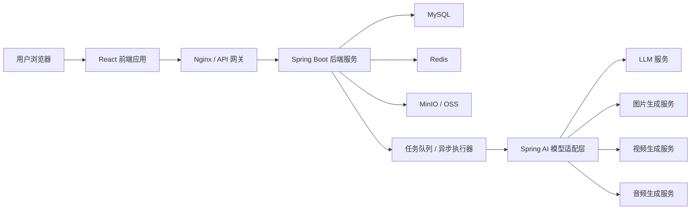
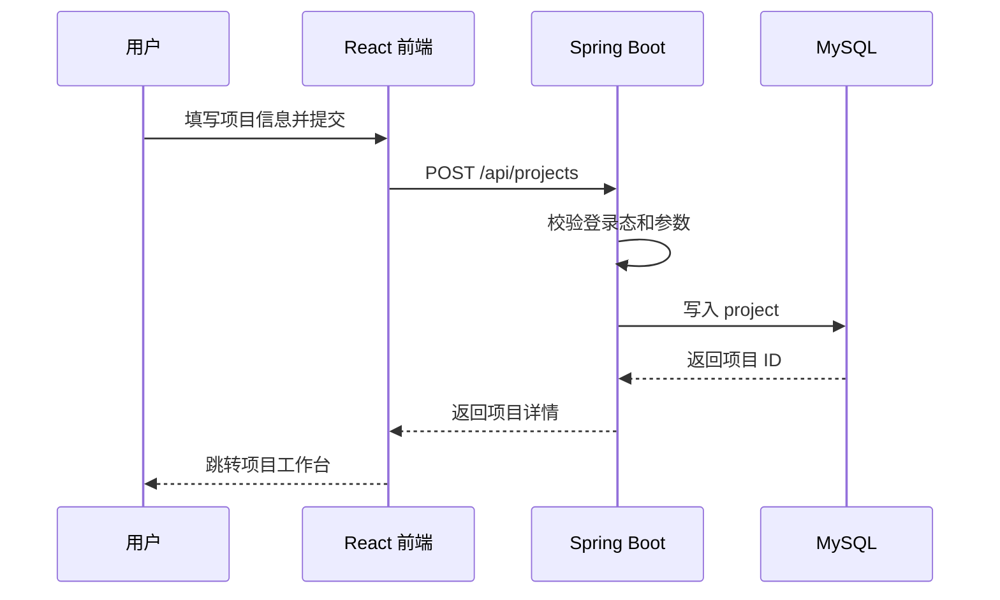
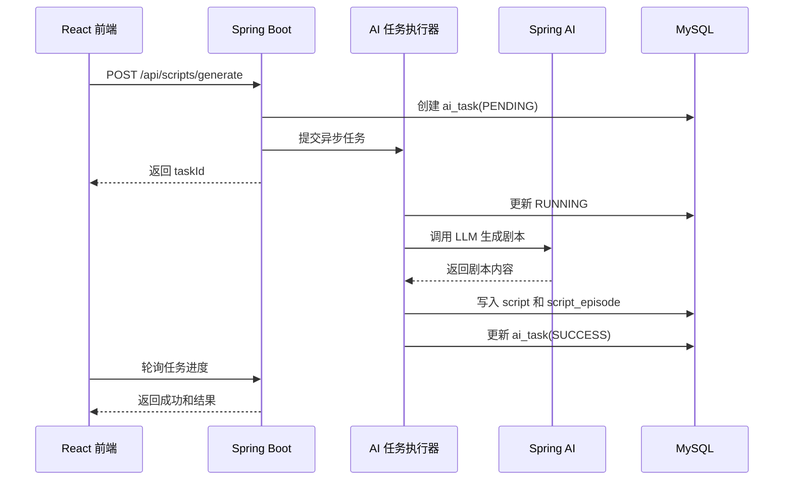

# Miioo 动画视频创作平台详细开发文档

| 文档属性 | 内容 |
| --- | --- |
| 项目名称 | Miioo 动画视频创作平台 |
| 文档类型 | 需求分析、概要设计、详细设计整合文档 |
| 前端技术栈 | React 18、TypeScript、Ant Design / Ant Design Pro、React Router、TanStack Query、Zustand |
| 后端技术栈 | Java 17、Spring Boot 3.x、Spring Security、Spring AI、MyBatis Plus、Redis、MySQL、MinIO / OSS |
| 适用对象 | 产品经理、前端开发、后端开发、测试工程师、运维工程师、算法/AI 接入工程师 |
| 文档版本 | v1.0 |
| 编写日期 | 2026-05-07 |

---

## 1. 项目背景与目标

### 1.1 项目背景

Miioo 动画视频创作平台是一款面向动画短剧、AI 视频、分镜创作、内容生产团队的全流程 AI 辅助创作系统。平台通过自然语言生成、剧本解析、主体提取、角色/场景/道具生成、智能分镜、分镜视频生成、剪辑合成等能力，降低用户从创意到成片的制作门槛。

传统动画视频创作通常涉及剧本策划、角色设定、场景设定、分镜绘制、配音音效、视频剪辑、成片导出等多个环节，流程长、门槛高、协作复杂。Miioo 平台希望通过 AI 生成和资产管理能力，将这些环节集中在一个项目工作台中，让创作者可以围绕同一个项目持续推进内容生产。

### 1.2 建设目标

1. 实现从创意输入到视频成片输出的端到端创作流程。
2. 支持用户通过自然语言或剧本文件快速生成多集短剧剧本。
3. 支持从剧本中自动提取角色、场景、道具等主体信息。
4. 支持角色、场景、道具的 AI 图片生成、编辑、定稿和复用。
5. 支持基于剧本和主体自动生成分镜，并生成分镜图与分镜视频。
6. 支持分镜序列剪辑、字幕、音频、转场、成片渲染和导出。
7. 支持项目资产与创作资产统一管理、筛选、预览、下载和复用。
8. 支持多模型配置，后端通过 Spring AI 和统一模型适配层接入 LLM、文生图、图生图、文生视频、语音等能力。

### 1.3 用户角色

| 用户角色 | 主要诉求 | 典型操作 |
| --- | --- | --- |
| 普通创作者 | 快速生成动画短剧或短视频 | 新建项目、生成剧本、生成角色、生成分镜、导出视频 |
| 专业编剧 | 优化剧情结构与台词表达 | 上传剧本、编辑剧本、使用 AI 助手优化剧情 |
| 分镜师 | 细化镜头语言和画面表现 | 调整分镜描述、生成分镜图、调整镜头顺序 |
| 视频剪辑师 | 将分镜素材组合为成片 | 调整镜头时长、添加字幕、合成音频、导出视频 |
| 管理员 | 管理模型、资源、用户和系统配置 | 配置模型、查看任务、管理用户与资源 |

---

## 2. 需求分析

### 2.1 总体业务流程

平台核心创作路径如下：

```text
首页
  -> 新建项目
  -> 项目全局设定
  -> 剧本生成 / 剧本上传
  -> 剧本解析与主体提取
  -> 角色 / 场景 / 道具管理
  -> 智能分镜生成
  -> 分镜图生成
  -> 分镜视频生成
  -> 剪辑成片
  -> 导出视频 / 资产入库
```

### 2.2 功能需求总览

| 功能域 | 功能模块 | 核心能力 |
| --- | --- | --- |
| 首页与导航 | 首页、侧边栏、快捷入口 | 展示产品主视觉，提供开始创作入口 |
| 项目管理 | 新建项目、项目列表、项目详情、项目配置 | 项目 CRUD、画面比例、视觉风格、封面管理 |
| 剧本管理 | 剧本生成、剧本上传、剧本预览、AI 编剧助手 | LLM 生成剧本、解析剧本、按集管理、台词优化 |
| 主体管理 | 角色、场景、道具 | 主体提取、AI 生成、编辑、定稿、音色配置 |
| 分镜管理 | 分镜初始化、分镜编辑、分镜图生成、分镜视频生成 | 镜头拆分、主体引用、图片/视频批量生成 |
| 剪辑成片 | 时间线、音频、字幕、转场、导出 | 分镜拼接、字幕生成、视频渲染、分辨率导出 |
| 资产库 | 项目资产、创作资产、资产选择弹窗 | 文件存储、筛选、预览、星标、下载、复用 |
| 模型配置 | 模型列表、模型参数、默认模型 | LLM、图片、视频、音频模型统一配置 |
| 任务中心 | AI 任务、渲染任务、批量任务 | 异步任务、进度查询、失败重试、通知 |
| 用户与权限 | 登录、认证、个人信息、数据隔离 | JWT 鉴权、用户项目隔离、接口权限 |

---

## 3. 页面与交互需求

### 3.1 首页

#### 3.1.1 页面目标

首页用于向用户展示平台的主要创作入口，帮助用户快速进入项目创建流程。页面应具备沉浸式视觉效果，并保持清晰的主操作按钮。

#### 3.1.2 页面模块

| 模块 | 功能说明 |
| --- | --- |
| 左侧导航栏 | 包含首页、项目、创作、资产库、配置中心等入口 |
| 主视觉区 | 背景为模拟列车窗外动态风景，营造创作旅程感 |
| 开始创作按钮 | 点击后进入新建项目页面或弹窗 |
| 最近项目 | 可选展示最近编辑的 3-5 个项目 |
| 任务提醒 | 展示最近完成或失败的 AI 生成任务 |

#### 3.1.3 交互规则

1. 用户未登录时点击开始创作，应跳转登录页。
2. 用户已登录时点击开始创作，应打开新建项目流程。
3. 最近项目卡片点击后直接进入项目工作台。
4. 任务提醒点击后进入任务中心或对应项目页面。

### 3.2 新建项目页

#### 3.2.1 字段要求

| 字段 | 类型 | 是否必填 | 说明 |
| --- | --- | --- | --- |
| 项目名称 | 输入框 | 是 | 长度 1-100 字，当前用户下不可重复 |
| 项目描述 | 多行文本 | 否 | 长度不超过 1000 字 |
| 画面比例 | 单选 | 是 | 支持 16:9、9:16，后续可扩展 1:1、4:3 |
| 视觉风格 | 下拉/卡片选择 | 是 | 动漫-日韩、3D-皮克斯卡通、写实真人、动漫-Q版可爱、像素风、自定义 |
| 自定义风格 | 输入框 | 条件必填 | 当用户选择自定义风格时显示 |
| 项目封面 | 图片上传 | 否 | 支持 jpg、png、webp，建议 2MB 以内 |

#### 3.2.2 校验规则

1. 项目名称不能为空。
2. 项目名称不能与当前用户已有项目重复。
3. 上传封面必须为图片格式。
4. 自定义风格输入不超过 200 字。

### 3.3 项目列表页

| 模块 | 功能说明 |
| --- | --- |
| 项目卡片 | 展示封面、名称、创建时间、更新时间、项目状态 |
| 新建项目卡片 | 点击后打开新建项目弹窗 |
| 搜索框 | 支持按项目名称模糊搜索 |
| 排序 | 支持按创建时间、更新时间、名称排序 |
| 项目菜单 | 支持重命名、复制、删除、打开资产目录 |
| 分页 | 默认每页 20 条 |

删除项目时需要二次确认。若项目存在正在执行的 AI 任务或视频渲染任务，应提示用户先取消任务或等待任务结束。

### 3.4 项目工作台

项目工作台是创作流程的核心页面，顶部使用项目级导航标签：

```text
全局设定 / 剧本 / 主体 / 分镜 / 剪辑成片 / 资产 / 任务
```

#### 3.4.1 全局设定

| 模块 | 功能说明 |
| --- | --- |
| 项目概况 | 展示角色数、场景数、道具数、剧本集数、分镜数、视频数 |
| 基础信息 | 编辑项目名称、描述、比例、风格、封面 |
| 默认模型配置 | 设置当前项目默认对话模型、图片模型、视频模型、音频模型 |
| 风格提示词 | 设置项目统一风格提示词，用于剧本、分镜和图片生成 |
| 安全操作 | 删除项目、导出项目数据 |

#### 3.4.2 剧本管理

| 模块 | 功能说明 |
| --- | --- |
| 剧本生成区 | 输入自然语言描述，选择模型、集数、风格，生成剧本 |
| 剧本上传区 | 支持上传 txt、md、docx、pdf 等剧本文档 |
| 集数目录 | 左侧展示剧集列表，支持新增、删除、排序 |
| 剧本详情 | 右侧展示当前集剧本、场景、台词、旁白、音效 |
| AI 编剧助手 | 支持优化台词、调整节奏、补充冲突、生成下一集 |
| 主体提取 | 从剧本中提取角色、场景、道具 |

剧本结构建议包含：

```text
剧集标题
故事梗概
场景列表
镜头列表
角色台词
旁白
音效说明
画面描述
情绪标签
```

#### 3.4.3 主体管理

主体包括角色、场景、道具三类。

| 模块 | 功能说明 |
| --- | --- |
| 分类 Tab | 角色 / 场景 / 道具切换，显示数量统计 |
| 主体卡片 | 展示预览图、名称、描述、音色、定稿状态 |
| 添加主体 | 手动创建角色、场景或道具 |
| 批量生成 | 基于剧本提取结果批量生成主体图 |
| 编辑弹窗 | 编辑名称、提示词、模型参数、参考图、生成结果 |
| 定稿操作 | 将满意的生成结果标记为最终版本 |
| 删除校验 | 如果主体被分镜引用，删除前需要提示影响范围 |

角色编辑弹窗字段：

| 字段 | 说明 |
| --- | --- |
| 角色名称 | 必填，当前项目内角色名称不重复 |
| 描述/提示词 | 支持 500 字以内描述 |
| 文生图模型 | 如 Doubao-Seed-2.0-Pro、Stable Diffusion、Midjourney 代理模型等 |
| 图片比例 | 支持 1:1、2:1、16:9、9:16 |
| 图片质量 | 支持 1K、2K、4K |
| 参考图 | 支持本地上传或资产库选择 |
| 生成模式 | 主视图、多视图 |
| 音色选择 | 角色配音音色，用于后续成片 |

#### 3.4.4 分镜管理

分镜是由剧本、角色、场景、道具共同生成的镜头级创作单元。

| 模块 | 功能说明 |
| --- | --- |
| 分镜列表 | 每一行对应一个镜头 |
| 镜头描述 | 包含景别、运镜、角度、构图、时长 |
| 光影配置 | 描述光线、色调、时间、天气 |
| 音频配置 | 环境音、旁白、角色台词、音效 |
| 主体引用 | 关联角色、场景、道具 |
| 分镜图 | 展示生成的镜头图片 |
| 分镜视频 | 展示图生视频或多参视频结果 |
| 批量操作 | 批量生成图片、视频、下载、开始剪辑 |
| 拖拽排序 | 支持调整镜头顺序 |

分镜图生成弹窗：

| 字段 | 说明 |
| --- | --- |
| 提示词 | 基于剧本文本和主体信息生成，可手动编辑 |
| 占位符 | 支持 `@角色`、`@场景`、`@道具` 引用 |
| 参考主体 | 从项目主体库中选择 |
| 图片模型 | 选择文生图或图生图模型 |
| 分辨率 | 支持 1K、2K、4K |
| 参考图 | 支持上传或资产库选择 |
| 结果操作 | 预览、下载、重新生成、定稿 |

分镜视频生成弹窗：

| 字段 | 说明 |
| --- | --- |
| 视频生成模式 | 首尾帧生成视频、多参考生成视频 |
| 提示词 | 描述镜头运动、角色动作、氛围 |
| 首帧图 | 可选择当前分镜图 |
| 尾帧图 | 可选择下一分镜图或手动上传 |
| 视频模型 | 选择文生视频或图生视频模型 |
| 时长 | 自动匹配镜头时长或手动输入 |
| 清晰度 | 720P、1080P、4K |
| 音效 | 是否自动生成或关联音效 |

#### 3.4.5 剪辑成片

| 模块 | 功能说明 |
| --- | --- |
| 时间线 | 按分镜顺序展示视频片段 |
| 视频预览 | 播放当前剪辑结果 |
| 片段编辑 | 调整时长、裁剪、替换片段 |
| 字幕轨道 | 自动根据台词生成字幕，支持手动修改 |
| 音频轨道 | 支持旁白、角色配音、背景音乐、音效 |
| 转场特效 | 支持淡入淡出、叠化、推拉等 |
| 成片导出 | 支持 720P、1080P、4K，mp4 格式 |
| 渲染任务 | 导出任务后台执行，任务中心查看进度 |

#### 3.4.6 资产库

资产分为项目资产与创作资产。

| 资产类型 | 说明 |
| --- | --- |
| 项目资产 | 与某个项目绑定，包括角色、场景、道具、分镜图、分镜视频、音频、成片 |
| 创作资产 | 用户历史生成或上传的全部资产，可跨项目复用 |

资产库页面功能：

| 模块 | 功能说明 |
| --- | --- |
| 顶部 Tab | 项目资产 / 创作资产 |
| 项目树 | 项目资产模式下展示项目目录树 |
| 分类筛选 | 图片、视频、音频、角色、场景、道具、分镜、成片 |
| 搜索 | 按资产名称搜索 |
| 排序 | 按创建时间、更新时间、名称排序 |
| 星标 | 收藏常用资产 |
| 批量操作 | 批量下载、删除、移动、星标 |
| 预览 | 支持图片大图、视频播放、音频试听 |
| 资产选择弹窗 | 在主体或分镜编辑时选择已有资产 |

---

## 4. 非功能需求

### 4.1 性能需求

| 指标 | 要求 |
| --- | --- |
| 首页首屏加载 | 首次加载 3 秒以内，二次加载 1.5 秒以内 |
| 项目列表加载 | 默认 20 条分页，响应时间 2 秒以内 |
| 图片预览加载 | CDN 加速后首图 1 秒以内显示 |
| AI 任务响应 | 创建任务接口 1 秒以内返回 taskId |
| AI 任务进度 | 前端每 2-5 秒查询一次或使用 SSE 推送 |
| 视频预览 | 支持分片或渐进式加载 |
| 批量下载 | 100 个以内项目资产打包时间建议 10 秒以内 |

### 4.2 安全需求

1. 使用 Spring Security + JWT 实现登录认证。
2. 所有业务接口默认要求登录态。
3. 项目、剧本、主体、分镜、资产均需要校验 `user_id`，禁止越权访问。
4. 用户上传文件需要校验类型、大小和扩展名。
5. 模型 API Key 仅存放在后端配置或密钥服务中，不下发到前端。
6. 删除项目、删除资产、删除主体需要二次确认。
7. 重要操作记录审计日志，如删除项目、删除成片、修改模型配置。

### 4.3 可扩展性需求

1. 模型接入采用统一适配层，新增模型厂商不影响业务模块。
2. 视觉风格模板采用配置化管理。
3. AI 任务类型可扩展，如后续增加音乐生成、口型生成、角色动作捕捉等。
4. 存储层支持 MinIO、阿里云 OSS、腾讯 COS、AWS S3 等兼容实现。
5. 前端页面使用模块化组件，主体、分镜、资产卡片可复用。

### 4.4 可用性需求

1. AI 任务失败时必须展示失败原因和重试入口。
2. 用户离开页面后，后台任务继续执行。
3. 任务完成后通过站内通知提醒用户。
4. 表单编辑需要防止误关闭，存在未保存内容时弹出确认提示。
5. 大批量生成任务需要支持取消。

---

## 5. 系统概要设计

### 5.1 总体架构



### 5.2 技术选型

| 层级 | 技术 | 用途 |
| --- | --- | --- |
| 前端框架 | React 18 + TypeScript | 构建单页应用 |
| UI 组件 | Ant Design / Ant Design Pro | 后台式复杂界面组件 |
| 路由 | React Router | 页面路由和项目内导航 |
| 状态管理 | Zustand | 管理用户信息、当前项目、全局配置 |
| 请求管理 | Axios + TanStack Query | API 请求、缓存、重试、加载状态 |
| 拖拽排序 | dnd-kit | 分镜排序、资产拖拽 |
| 视频播放 | video.js 或原生 video | 分镜视频和成片预览 |
| 后端框架 | Spring Boot 3.x | REST API 和业务服务 |
| AI 框架 | Spring AI | LLM 对话、提示词编排、模型抽象 |
| 权限 | Spring Security + JWT | 登录认证和接口鉴权 |
| ORM | MyBatis Plus | 数据访问层 |
| 缓存 | Redis | Token 黑名单、任务进度、热点数据 |
| 数据库 | MySQL 8 | 结构化业务数据 |
| 文件存储 | MinIO / OSS | 图片、视频、剧本文件、成片 |
| 异步任务 | Spring Task / ThreadPoolTaskExecutor / MQ | AI 生成与渲染任务 |
| 文档接口 | OpenAPI / Knife4j | API 文档和调试 |

### 5.3 后端分层

```text
controller
  -> request / response DTO
service
  -> domain service
  -> ai orchestration service
mapper
  -> MyBatis Plus mapper
entity
  -> database entity
integration
  -> model provider client
  -> storage client
  -> notification client
config
  -> security / redis / spring ai / async / storage
```

### 5.4 模块划分

| 模块 | 后端包建议 | 说明 |
| --- | --- | --- |
| 用户认证 | `auth` | 登录、注册、JWT、用户信息 |
| 项目管理 | `project` | 项目 CRUD、全局设定 |
| 剧本管理 | `script` | 剧本生成、上传、解析、集数管理 |
| 主体管理 | `subject` | 角色、场景、道具管理和生成 |
| 分镜管理 | `storyboard` | 分镜初始化、编辑、图片/视频生成 |
| 剪辑成片 | `render` | 视频合成、字幕、导出任务 |
| 资产库 | `asset` | 上传、预览、筛选、星标、下载 |
| 模型配置 | `model` | 模型厂商、模型能力、默认配置 |
| AI 任务 | `aitask` | 异步任务、进度、失败重试 |
| 通知中心 | `notification` | 任务完成、失败、系统消息 |

---

## 6. 数据库详细设计

### 6.1 通用字段规范

所有核心业务表建议包含以下字段：

| 字段 | 类型 | 说明 |
| --- | --- | --- |
| id | bigint | 主键，雪花 ID 或自增 ID |
| create_time | datetime | 创建时间 |
| update_time | datetime | 更新时间 |
| deleted | tinyint | 逻辑删除标识，0 正常，1 删除 |

### 6.2 用户表 `user`

| 字段 | 类型 | 约束 | 说明 |
| --- | --- | --- | --- |
| id | bigint | PK | 用户 ID |
| username | varchar(50) | unique | 用户名 |
| password | varchar(100) | not null | BCrypt 加密密码 |
| email | varchar(100) | nullable | 邮箱 |
| avatar_url | varchar(255) | nullable | 头像 |
| status | varchar(20) | not null | ENABLED、DISABLED |
| create_time | datetime | not null | 创建时间 |
| update_time | datetime | not null | 更新时间 |
| deleted | tinyint | not null | 逻辑删除 |

### 6.3 项目表 `project`

| 字段 | 类型 | 约束 | 说明 |
| --- | --- | --- | --- |
| id | bigint | PK | 项目 ID |
| user_id | bigint | index | 所属用户 |
| name | varchar(100) | not null | 项目名称 |
| description | text | nullable | 项目描述 |
| ratio | varchar(10) | not null | 16:9、9:16 |
| style_code | varchar(50) | not null | 风格编码 |
| style_prompt | text | nullable | 自定义风格提示词 |
| cover_asset_id | bigint | nullable | 封面资产 ID |
| status | varchar(20) | not null | NORMAL、ARCHIVED |
| create_time | datetime | not null | 创建时间 |
| update_time | datetime | not null | 更新时间 |
| deleted | tinyint | not null | 逻辑删除 |

### 6.4 剧本表 `script`

| 字段 | 类型 | 约束 | 说明 |
| --- | --- | --- | --- |
| id | bigint | PK | 剧本 ID |
| project_id | bigint | index | 项目 ID |
| title | varchar(100) | not null | 剧本标题 |
| source_type | varchar(20) | not null | AI_GENERATED、UPLOADED、MANUAL |
| content | longtext | not null | 完整剧本内容 |
| outline | text | nullable | 故事大纲 |
| episode_count | int | not null | 集数 |
| model_id | bigint | nullable | 生成模型 ID |
| create_time | datetime | not null | 创建时间 |
| update_time | datetime | not null | 更新时间 |
| deleted | tinyint | not null | 逻辑删除 |

### 6.5 剧集表 `script_episode`

| 字段 | 类型 | 约束 | 说明 |
| --- | --- | --- | --- |
| id | bigint | PK | 剧集 ID |
| script_id | bigint | index | 剧本 ID |
| project_id | bigint | index | 项目 ID |
| episode_no | int | not null | 第几集 |
| title | varchar(100) | not null | 剧集标题 |
| summary | text | nullable | 剧集简介 |
| content | longtext | not null | 当前集剧本 |
| create_time | datetime | not null | 创建时间 |
| update_time | datetime | not null | 更新时间 |
| deleted | tinyint | not null | 逻辑删除 |

### 6.6 主体表 `subject`

| 字段 | 类型 | 约束 | 说明 |
| --- | --- | --- | --- |
| id | bigint | PK | 主体 ID |
| project_id | bigint | index | 项目 ID |
| type | varchar(20) | index | CHARACTER、SCENE、PROP |
| name | varchar(100) | not null | 主体名称 |
| description | text | nullable | 描述 |
| prompt | text | nullable | 生成提示词 |
| preview_asset_id | bigint | nullable | 当前预览资产 |
| final_asset_id | bigint | nullable | 定稿资产 |
| voice_id | bigint | nullable | 音色 ID，仅角色常用 |
| finalized | tinyint | not null | 是否定稿 |
| create_time | datetime | not null | 创建时间 |
| update_time | datetime | not null | 更新时间 |
| deleted | tinyint | not null | 逻辑删除 |

### 6.7 分镜表 `storyboard`

| 字段 | 类型 | 约束 | 说明 |
| --- | --- | --- | --- |
| id | bigint | PK | 分镜 ID |
| project_id | bigint | index | 项目 ID |
| episode_id | bigint | index | 剧集 ID |
| shot_index | int | not null | 镜头序号 |
| title | varchar(100) | nullable | 镜头标题 |
| scene_desc | text | not null | 画面描述 |
| camera_desc | text | nullable | 景别、运镜、角度、构图 |
| duration_seconds | decimal(5,2) | nullable | 镜头时长 |
| light_setting | varchar(255) | nullable | 光影说明 |
| sound_setting | varchar(255) | nullable | 环境音、音效、配音说明 |
| narration | text | nullable | 旁白 |
| dialogue | text | nullable | 台词 |
| image_asset_id | bigint | nullable | 分镜图资产 |
| video_asset_id | bigint | nullable | 分镜视频资产 |
| status | varchar(20) | not null | DRAFT、IMAGE_DONE、VIDEO_DONE、FINALIZED |
| create_time | datetime | not null | 创建时间 |
| update_time | datetime | not null | 更新时间 |
| deleted | tinyint | not null | 逻辑删除 |

### 6.8 主体分镜关联表 `subject_storyboard_rel`

| 字段 | 类型 | 约束 | 说明 |
| --- | --- | --- | --- |
| id | bigint | PK | 关联 ID |
| subject_id | bigint | index | 主体 ID |
| storyboard_id | bigint | index | 分镜 ID |
| subject_type | varchar(20) | index | CHARACTER、SCENE、PROP |
| create_time | datetime | not null | 创建时间 |

### 6.9 资产表 `asset`

| 字段 | 类型 | 约束 | 说明 |
| --- | --- | --- | --- |
| id | bigint | PK | 资产 ID |
| user_id | bigint | index | 用户 ID |
| project_id | bigint | nullable | 项目 ID，创作资产可为空 |
| name | varchar(100) | not null | 资产名称 |
| asset_type | varchar(30) | index | CHARACTER、SCENE、PROP、STORYBOARD_IMAGE、STORYBOARD_VIDEO、AUDIO、FINAL_VIDEO、SCRIPT |
| file_type | varchar(20) | not null | png、jpg、mp4、mp3、txt 等 |
| mime_type | varchar(100) | nullable | MIME 类型 |
| storage_key | varchar(255) | not null | 存储对象 key |
| url | varchar(500) | not null | 访问地址或签名地址 |
| size_bytes | bigint | nullable | 文件大小 |
| width | int | nullable | 图片/视频宽度 |
| height | int | nullable | 图片/视频高度 |
| duration_seconds | decimal(8,2) | nullable | 音视频时长 |
| is_starred | tinyint | not null | 是否星标 |
| source | varchar(20) | not null | UPLOAD、AI_GENERATED、RENDERED |
| create_time | datetime | not null | 创建时间 |
| update_time | datetime | not null | 更新时间 |
| deleted | tinyint | not null | 逻辑删除 |

### 6.10 AI 任务表 `ai_task`

| 字段 | 类型 | 约束 | 说明 |
| --- | --- | --- | --- |
| id | bigint | PK | 任务 ID |
| user_id | bigint | index | 用户 ID |
| project_id | bigint | nullable | 项目 ID |
| biz_id | bigint | nullable | 业务对象 ID，如剧本 ID、分镜 ID |
| task_type | varchar(30) | index | SCRIPT、SUBJECT_IMAGE、STORYBOARD_INIT、STORYBOARD_IMAGE、STORYBOARD_VIDEO、VIDEO_RENDER |
| status | varchar(20) | index | PENDING、RUNNING、SUCCESS、FAILED、CANCELLED |
| progress | int | not null | 0-100 |
| model_id | bigint | nullable | 使用模型 |
| request_payload | json | nullable | 请求参数 |
| result_payload | json | nullable | 结果数据 |
| error_message | text | nullable | 错误信息 |
| retry_count | int | not null | 重试次数 |
| start_time | datetime | nullable | 开始时间 |
| finish_time | datetime | nullable | 完成时间 |
| create_time | datetime | not null | 创建时间 |
| update_time | datetime | not null | 更新时间 |

### 6.11 模型配置表 `ai_model`

| 字段 | 类型 | 约束 | 说明 |
| --- | --- | --- | --- |
| id | bigint | PK | 模型 ID |
| provider | varchar(50) | not null | OPENAI、DOUBAO、ALIYUN、CUSTOM |
| model_code | varchar(100) | not null | 模型编码 |
| model_name | varchar(100) | not null | 展示名称 |
| capability | varchar(30) | index | CHAT、IMAGE、VIDEO、AUDIO、EMBEDDING |
| endpoint | varchar(255) | nullable | 自定义 endpoint |
| enabled | tinyint | not null | 是否启用 |
| default_params | json | nullable | 默认参数 |
| create_time | datetime | not null | 创建时间 |
| update_time | datetime | not null | 更新时间 |

---

## 7. 接口详细设计

### 7.1 通用响应格式

```json
{
  "code": 200,
  "message": "success",
  "data": {},
  "traceId": "20260507150000123"
}
```

### 7.2 通用分页格式

```json
{
  "pageNo": 1,
  "pageSize": 20,
  "total": 100,
  "records": []
}
```

### 7.3 认证接口

#### 登录

```http
POST /api/auth/login
```

请求体：

```json
{
  "username": "demo",
  "password": "123456"
}
```

响应体：

```json
{
  "code": 200,
  "data": {
    "token": "jwt-token",
    "expiresIn": 7200,
    "user": {
      "id": 1,
      "username": "demo",
      "avatarUrl": "https://example.com/avatar.png"
    }
  }
}
```

### 7.4 项目接口

| 接口 | 方法 | 说明 |
| --- | --- | --- |
| `/api/projects` | POST | 创建项目 |
| `/api/projects` | GET | 分页查询项目 |
| `/api/projects/{id}` | GET | 查询项目详情 |
| `/api/projects/{id}` | PUT | 更新项目 |
| `/api/projects/{id}` | DELETE | 删除项目 |
| `/api/projects/{id}/summary` | GET | 查询项目统计概况 |

创建项目请求：

```json
{
  "name": "两只老虎的青枫奇遇",
  "description": "森林冒险题材动画短剧",
  "ratio": "16:9",
  "styleCode": "anime_japanese",
  "stylePrompt": "日系动画风格，明亮自然，适合儿童短剧",
  "coverAssetId": 10001
}
```

### 7.5 剧本接口

| 接口 | 方法 | 说明 |
| --- | --- | --- |
| `/api/scripts/generate` | POST | 创建剧本生成任务 |
| `/api/scripts/upload` | POST | 上传剧本文件 |
| `/api/scripts/project/{projectId}` | GET | 查询项目剧本 |
| `/api/scripts/{scriptId}` | PUT | 编辑剧本 |
| `/api/scripts/{scriptId}/episodes` | GET | 查询剧集列表 |
| `/api/scripts/{scriptId}/extract-subjects` | POST | 提取主体 |
| `/api/scripts/assistant/rewrite` | POST | AI 改写剧本文本 |

剧本生成请求：

```json
{
  "projectId": 123,
  "prompt": "生成 5 集森林老虎冒险短剧剧本，每集 1 分钟，适合儿童观看",
  "modelId": 10,
  "episodeCount": 5,
  "stylePrompt": "温暖、幽默、冒险、节奏轻快"
}
```

响应：

```json
{
  "code": 200,
  "data": {
    "taskId": 456,
    "status": "PENDING"
  }
}
```

### 7.6 主体接口

| 接口 | 方法 | 说明 |
| --- | --- | --- |
| `/api/subjects` | POST | 创建主体 |
| `/api/subjects` | GET | 查询主体列表 |
| `/api/subjects/{id}` | GET | 查询主体详情 |
| `/api/subjects/{id}` | PUT | 更新主体 |
| `/api/subjects/{id}` | DELETE | 删除主体 |
| `/api/subjects/generate` | POST | 生成主体图片 |
| `/api/subjects/batch-generate` | POST | 批量生成主体图片 |
| `/api/subjects/{id}/finalize` | PUT | 定稿主体 |

生成主体图片请求：

```json
{
  "projectId": 123,
  "subjectId": 789,
  "type": "CHARACTER",
  "prompt": "一只勇敢的小老虎，橙色毛发，圆眼睛，儿童动画风格",
  "modelId": 20,
  "ratio": "1:1",
  "quality": "2K",
  "referenceAssetIds": [10001, 10002],
  "generateMode": "MAIN_VIEW"
}
```

### 7.7 分镜接口

| 接口 | 方法 | 说明 |
| --- | --- | --- |
| `/api/storyboards/init` | POST | 基于剧集初始化分镜 |
| `/api/storyboards` | GET | 查询分镜列表 |
| `/api/storyboards/{id}` | PUT | 编辑分镜 |
| `/api/storyboards/reorder` | PUT | 批量调整顺序 |
| `/api/storyboards/generate-image` | POST | 生成分镜图 |
| `/api/storyboards/generate-video` | POST | 生成分镜视频 |
| `/api/storyboards/batch-generate-image` | POST | 批量生成分镜图 |
| `/api/storyboards/batch-generate-video` | POST | 批量生成分镜视频 |
| `/api/storyboards/{id}/finalize` | PUT | 定稿分镜 |

分镜初始化请求：

```json
{
  "episodeId": 123,
  "autoGenerate": true,
  "modelId": 10
}
```

分镜图生成请求：

```json
{
  "storyboardId": 456,
  "prompt": "吉卜力风格，在森林小路中，小老虎背着小包向远处山坡奔跑，镜头低机位跟拍，清晨柔和阳光",
  "modelId": 20,
  "resolution": "2K",
  "subjectRefIds": [789, 790],
  "referenceAssetIds": [10001]
}
```

分镜视频生成请求：

```json
{
  "storyboardId": 456,
  "mode": "FIRST_LAST_FRAME",
  "prompt": "小老虎沿森林小路向前奔跑，树叶轻微晃动，镜头缓慢推进",
  "modelId": 30,
  "firstFrameAssetId": 20001,
  "lastFrameAssetId": 20002,
  "durationSeconds": 5,
  "resolution": "1080P",
  "enableSoundEffect": true
}
```

### 7.8 剪辑与渲染接口

| 接口 | 方法 | 说明 |
| --- | --- | --- |
| `/api/render/preview` | POST | 生成预览视频 |
| `/api/render/export` | POST | 创建成片导出任务 |
| `/api/render/tasks/{taskId}` | GET | 查询渲染任务 |
| `/api/render/tasks/{taskId}/cancel` | POST | 取消渲染任务 |

导出请求：

```json
{
  "projectId": 123,
  "episodeId": 456,
  "resolution": "1080P",
  "format": "mp4",
  "includeSubtitle": true,
  "includeBackgroundMusic": true,
  "transition": "FADE"
}
```

### 7.9 资产接口

| 接口 | 方法 | 说明 |
| --- | --- | --- |
| `/api/assets/upload` | POST | 上传资产 |
| `/api/assets` | GET | 查询资产列表 |
| `/api/assets/{id}` | GET | 查询资产详情 |
| `/api/assets/{id}` | DELETE | 删除资产 |
| `/api/assets/{id}/star` | PUT | 星标或取消星标 |
| `/api/assets/batch-download` | POST | 批量打包下载 |
| `/api/assets/selectable` | GET | 查询资产选择弹窗列表 |

资产查询示例：

```http
GET /api/assets?projectId=123&assetType=CHARACTER&starred=false&pageNo=1&pageSize=30
```

### 7.10 AI 任务接口

| 接口 | 方法 | 说明 |
| --- | --- | --- |
| `/api/ai-tasks/{taskId}` | GET | 查询任务详情 |
| `/api/ai-tasks/{taskId}/progress` | GET | 查询任务进度 |
| `/api/ai-tasks/{taskId}/cancel` | POST | 取消任务 |
| `/api/ai-tasks/{taskId}/retry` | POST | 重试失败任务 |
| `/api/ai-tasks/my` | GET | 查询当前用户任务 |

任务进度响应：

```json
{
  "taskId": 456,
  "taskType": "STORYBOARD_IMAGE",
  "status": "RUNNING",
  "progress": 65,
  "message": "正在生成第 13 / 20 张分镜图",
  "result": null
}
```

---

## 8. 前端 React 详细设计

### 8.1 前端目录结构

```text
src/
  api/
    auth.ts
    project.ts
    script.ts
    subject.ts
    storyboard.ts
    asset.ts
    aiTask.ts
  components/
    AppLayout/
    ProjectCard/
    AssetCard/
    TaskProgress/
    ModelSelector/
    UploadPanel/
  pages/
    Home/
    Login/
    ProjectList/
    ProjectWorkspace/
      GlobalSettings/
      Script/
      Subject/
      Storyboard/
      Render/
      Asset/
      Task/
  store/
    userStore.ts
    projectStore.ts
    uiStore.ts
  hooks/
    useCurrentProject.ts
    useTaskPolling.ts
    useAssetSelector.ts
  router/
    index.tsx
  types/
    project.ts
    script.ts
    subject.ts
    storyboard.ts
    asset.ts
    aiTask.ts
  utils/
    request.ts
    file.ts
    format.ts
```

### 8.2 路由设计

| 路由 | 页面 | 说明 |
| --- | --- | --- |
| `/login` | 登录页 | 用户登录 |
| `/` | 首页 | 平台首页 |
| `/projects` | 项目列表 | 查看和管理项目 |
| `/projects/new` | 新建项目 | 创建项目 |
| `/projects/:projectId/settings` | 全局设定 | 项目设置 |
| `/projects/:projectId/scripts` | 剧本 | 剧本生成和编辑 |
| `/projects/:projectId/subjects` | 主体 | 角色、场景、道具 |
| `/projects/:projectId/storyboards` | 分镜 | 分镜管理 |
| `/projects/:projectId/render` | 剪辑成片 | 成片合成 |
| `/projects/:projectId/assets` | 项目资产 | 项目资产库 |
| `/assets` | 创作资产 | 全局资产库 |
| `/tasks` | 任务中心 | AI 任务和渲染任务 |
| `/models` | 模型配置 | 模型管理 |

### 8.3 全局状态

#### userStore

```ts
type UserState = {
  token: string | null;
  userInfo: UserInfo | null;
  setToken: (token: string) => void;
  setUserInfo: (userInfo: UserInfo) => void;
  logout: () => void;
};
```

#### projectStore

```ts
type ProjectState = {
  currentProjectId?: string;
  currentProject?: ProjectDetail;
  setCurrentProject: (project: ProjectDetail) => void;
  clearCurrentProject: () => void;
};
```

### 8.4 请求封装

1. Axios 请求拦截器自动追加 `Authorization: Bearer <token>`。
2. 响应拦截器统一处理 401、403、500 等错误。
3. TanStack Query 负责请求缓存、加载状态、失败重试。
4. 文件上传使用 `multipart/form-data`，展示上传进度。

示例：

```ts
export async function createProject(payload: CreateProjectRequest) {
  return request.post<ApiResult<ProjectDetail>>('/api/projects', payload);
}
```

### 8.5 页面组件拆分

#### 8.5.1 项目列表页

```text
ProjectListPage
  -> ProjectToolbar
  -> ProjectGrid
    -> ProjectCard
    -> CreateProjectCard
  -> CreateProjectModal
```

核心状态：

| 状态 | 说明 |
| --- | --- |
| keyword | 搜索关键词 |
| sortBy | 排序字段 |
| pageNo/pageSize | 分页参数 |
| createModalOpen | 新建项目弹窗 |

#### 8.5.2 剧本页面

```text
ScriptPage
  -> ScriptGeneratePanel
  -> ScriptUploadPanel
  -> EpisodeList
  -> ScriptEditor
  -> ScriptAiAssistant
  -> ExtractSubjectButton
```

关键交互：

1. 点击生成剧本后创建 AI 任务。
2. 前端进入任务轮询状态。
3. 任务成功后刷新剧本与剧集列表。
4. 点击提取主体后进入主体确认弹窗。

#### 8.5.3 主体页面

```text
SubjectPage
  -> SubjectTabs
  -> SubjectActionBar
  -> SubjectGrid
    -> SubjectCard
    -> AddSubjectCard
  -> SubjectEditModal
  -> AssetSelectModal
  -> BatchGenerateDrawer
```

主体卡片应展示：

1. 预览图。
2. 名称。
3. 类型。
4. 描述摘要。
5. 音色。
6. 定稿状态。
7. 下载、编辑、删除按钮。

#### 8.5.4 分镜页面

```text
StoryboardPage
  -> EpisodeSelector
  -> StoryboardBatchToolbar
  -> StoryboardList
    -> StoryboardRow
      -> ShotDescriptionEditor
      -> SubjectReferenceList
      -> StoryboardImagePreview
      -> StoryboardVideoPreview
  -> StoryboardImageGenerateModal
  -> StoryboardVideoGenerateModal
```

分镜行推荐字段：

| 字段 | 展示方式 |
| --- | --- |
| 镜头序号 | 数字标签 |
| 画面描述 | 可编辑文本区域 |
| 景别/运镜 | 标签或折叠详情 |
| 主体引用 | 头像/缩略图列表 |
| 图片 | 缩略图预览 |
| 视频 | 播放按钮 |
| 状态 | 标签 |
| 操作 | 编辑、生成图片、生成视频、删除 |

#### 8.5.5 资产库页面

```text
AssetLibraryPage
  -> AssetModeTabs
  -> ProjectAssetTree
  -> AssetFilterBar
  -> AssetGrid
    -> AssetCard
  -> AssetPreviewModal
  -> BatchDownloadModal
```

### 8.6 AI 任务轮询 Hook

```ts
export function useTaskPolling(taskId?: string, enabled = true) {
  return useQuery({
    queryKey: ['ai-task', taskId],
    queryFn: () => getAiTaskProgress(taskId!),
    enabled: Boolean(taskId) && enabled,
    refetchInterval: (query) => {
      const status = query.state.data?.status;
      return status === 'SUCCESS' || status === 'FAILED' || status === 'CANCELLED'
        ? false
        : 3000;
    },
  });
}
```

### 8.7 前端异常与空状态

| 场景 | 处理方式 |
| --- | --- |
| 项目为空 | 展示新建项目引导 |
| 剧本为空 | 展示生成剧本和上传剧本入口 |
| 主体为空 | 展示添加主体和从剧本提取入口 |
| 分镜为空 | 展示开始智能分镜按钮 |
| 资产为空 | 展示上传资产或生成资产入口 |
| AI 任务失败 | 显示失败原因和重试按钮 |
| 网络异常 | Toast 提示，保留当前编辑内容 |

---

## 9. 后端 Spring Boot 详细设计

### 9.1 后端目录结构

```text
src/main/java/com/miioo/
  MiiooApplication.java
  common/
    ApiResult.java
    PageResult.java
    BizException.java
    ErrorCode.java
  config/
    SecurityConfig.java
    RedisConfig.java
    AsyncConfig.java
    SpringAiConfig.java
    StorageConfig.java
  auth/
    AuthController.java
    AuthService.java
    JwtTokenProvider.java
  project/
    ProjectController.java
    ProjectService.java
    ProjectMapper.java
    entity/Project.java
    dto/
  script/
  subject/
  storyboard/
  asset/
  aitask/
  model/
  render/
  integration/
    storage/
    ai/
    video/
```

### 9.2 Controller 设计原则

1. Controller 只负责参数接收、权限校验入口和响应封装。
2. 业务逻辑放在 Service 层。
3. AI 模型调用不直接写在业务 Service 中，应通过 AI 编排服务或模型适配器调用。
4. 所有接口必须校验当前登录用户是否有权访问目标项目。

示例：

```java
@RestController
@RequestMapping("/api/projects")
public class ProjectController {

    private final ProjectService projectService;

    @PostMapping
    public ApiResult<ProjectDetailResponse> create(@RequestBody @Valid CreateProjectRequest request) {
        Long userId = SecurityUtils.currentUserId();
        return ApiResult.success(projectService.create(userId, request));
    }
}
```

### 9.3 Service 设计原则

1. 核心业务方法使用事务。
2. 删除操作默认逻辑删除。
3. AI 生成操作先创建任务，再异步执行。
4. 文件入库要保证对象存储和数据库记录的一致性。
5. 涉及跨表更新时使用事务，异步任务中的状态更新要保证幂等。

### 9.4 异步任务执行

AI 生成和视频渲染耗时较长，必须采用异步任务模式。

执行流程：

```text
前端提交生成请求
  -> 后端校验参数与权限
  -> 创建 ai_task 记录，状态 PENDING
  -> 提交到线程池或消息队列
  -> 立即返回 taskId
  -> 异步执行任务，更新进度
  -> 成功后写入业务表和 asset 表
  -> 失败后记录 error_message
  -> 前端轮询或接收推送
```

线程池配置建议：

```java
@Bean
public ThreadPoolTaskExecutor aiTaskExecutor() {
    ThreadPoolTaskExecutor executor = new ThreadPoolTaskExecutor();
    executor.setCorePoolSize(8);
    executor.setMaxPoolSize(32);
    executor.setQueueCapacity(200);
    executor.setThreadNamePrefix("ai-task-");
    executor.initialize();
    return executor;
}
```

### 9.5 权限校验

建议封装项目权限服务：

```java
public void checkProjectOwner(Long userId, Long projectId) {
    boolean exists = projectMapper.existsByIdAndUserId(projectId, userId);
    if (!exists) {
        throw new BizException(ErrorCode.FORBIDDEN, "无权访问该项目");
    }
}
```

所有项目相关接口都需要调用该方法。

---

## 10. Spring AI 与 AI 能力设计

### 10.1 AI 能力分类

| 能力 | 输入 | 输出 | 典型场景 |
| --- | --- | --- | --- |
| 剧本生成 | 用户创意、风格、集数 | 结构化剧本 | 新建剧本 |
| 剧本改写 | 原文本、改写要求 | 优化后文本 | 编剧助手 |
| 主体提取 | 剧本文本 | 角色、场景、道具列表 | 主体初始化 |
| 分镜生成 | 剧集内容、主体信息 | 分镜列表 | 智能分镜 |
| 提示词生成 | 分镜、主体、风格 | 图片/视频提示词 | 分镜图和视频 |
| 图片生成 | 提示词、参考图 | 图片资产 | 角色、场景、道具、分镜图 |
| 视频生成 | 提示词、首尾帧 | 视频资产 | 分镜视频 |
| 音频生成 | 台词、音色、情绪 | 音频资产 | 配音、旁白 |

### 10.2 Spring AI 使用方式

Spring AI 主要负责 LLM 对话、结构化输出和提示词编排。文生图、文生视频如当前模型厂商未被 Spring AI 原生支持，可通过自定义 `AiModelAdapter` 封装 HTTP API。

核心接口建议：

```java
public interface AiGenerationService {
    ScriptResult generateScript(ScriptGenerateCommand command);
    List<SubjectCandidate> extractSubjects(SubjectExtractCommand command);
    List<StoryboardCandidate> generateStoryboards(StoryboardGenerateCommand command);
    String optimizePrompt(PromptOptimizeCommand command);
}
```

### 10.3 Spring AI ChatClient 示例

```java
@Service
public class ScriptAiService {

    private final ChatClient chatClient;

    public ScriptAiService(ChatClient.Builder builder) {
        this.chatClient = builder.build();
    }

    public String generateScript(String userPrompt, int episodeCount, String stylePrompt) {
        return chatClient.prompt()
            .system("""
                你是动画短剧编剧助手，需要输出结构化剧本。
                必须包含剧集标题、故事梗概、场景、镜头、台词、旁白、音效说明。
                """)
            .user("""
                创作要求：%s
                集数：%d
                风格：%s
                """.formatted(userPrompt, episodeCount, stylePrompt))
            .call()
            .content();
    }
}
```

### 10.4 结构化输出建议

剧本、主体提取、分镜生成建议要求模型输出 JSON，后端使用 Jackson 解析并校验字段。

主体提取输出示例：

```json
{
  "characters": [
    {
      "name": "小虎",
      "description": "勇敢、好奇、橙色毛发的小老虎",
      "prompt": "cute brave little tiger, orange fur, big round eyes, anime style"
    }
  ],
  "scenes": [
    {
      "name": "青枫森林",
      "description": "有蓝绿色枫叶、清晨薄雾和木质小路的森林"
    }
  ],
  "props": [
    {
      "name": "探险背包",
      "description": "棕色小背包，装着地图和水壶"
    }
  ]
}
```

### 10.5 图片与视频模型适配层

由于图片和视频模型厂商接口差异较大，建议定义统一适配器：

```java
public interface ImageModelAdapter {
    ImageGenerateResult generate(ImageGenerateRequest request);
}

public interface VideoModelAdapter {
    VideoGenerateResult generate(VideoGenerateRequest request);
}
```

根据 `ai_model.provider` 和 `ai_model.model_code` 选择具体实现：

```text
ImageModelAdapter
  -> DoubaoImageModelAdapter
  -> StableDiffusionAdapter
  -> CustomHttpImageAdapter

VideoModelAdapter
  -> SeDanceVideoModelAdapter
  -> CustomHttpVideoAdapter
```

### 10.6 提示词模板管理

提示词模板建议配置化，便于后续调优。

| 模板编码 | 用途 |
| --- | --- |
| `script.generate` | 剧本生成 |
| `script.extract_subject` | 主体提取 |
| `storyboard.init` | 分镜初始化 |
| `storyboard.image_prompt` | 分镜图提示词 |
| `storyboard.video_prompt` | 分镜视频提示词 |
| `subject.character_prompt` | 角色图片提示词 |
| `subject.scene_prompt` | 场景图片提示词 |
| `subject.prop_prompt` | 道具图片提示词 |

模板变量示例：

```text
项目风格：{{projectStyle}}
剧集内容：{{episodeContent}}
角色列表：{{characters}}
场景列表：{{scenes}}
道具列表：{{props}}
输出要求：请输出 JSON 数组，每个元素代表一个镜头。
```

---

## 11. 核心业务流程详细设计

### 11.1 新建项目流程



### 11.2 剧本生成流程



### 11.3 主体提取与生成流程

1. 用户在剧本页点击“开始提取主体”。
2. 后端读取剧本内容，调用 LLM 提取角色、场景、道具。
3. 后端返回候选主体列表，前端展示确认弹窗。
4. 用户确认后写入 `subject` 表。
5. 用户选择批量生成主体图片。
6. 后端为每个主体创建 AI 任务，调用图片模型生成。
7. 生成图片保存到对象存储，同时写入 `asset` 表。
8. 生成结果回填 `subject.preview_asset_id`。
9. 用户选择满意结果后点击定稿，更新 `subject.final_asset_id`。

### 11.4 分镜生成流程

1. 用户选择剧集后点击“开始智能分镜”。
2. 后端读取当前剧集剧本与项目主体。
3. Spring AI 根据剧本拆分镜头，生成分镜描述、景别、时长、音频说明。
4. 后端写入 `storyboard` 表和 `subject_storyboard_rel` 表。
5. 前端展示分镜列表。
6. 用户可以编辑单条分镜，也可以批量生成分镜图。
7. 分镜图生成成功后写入资产库并更新 `storyboard.image_asset_id`。
8. 用户继续生成分镜视频，成功后更新 `storyboard.video_asset_id`。

### 11.5 成片导出流程

1. 用户进入剪辑成片页。
2. 前端按分镜顺序加载分镜视频、字幕、音频。
3. 用户调整片段时长、字幕和转场。
4. 点击导出后创建渲染任务。
5. 后端通过视频处理服务或 FFmpeg 合成成片。
6. 成片上传对象存储并写入 `asset` 表。
7. 任务中心通知用户导出完成。

---

## 12. 文件存储设计

### 12.1 存储目录规范

```text
miioo/
  users/{userId}/
    projects/{projectId}/
      cover/
      scripts/
      subjects/
        characters/
        scenes/
        props/
      storyboards/
        images/
        videos/
      audio/
      renders/
    creation-assets/
      images/
      videos/
      audios/
```

### 12.2 文件命名规范

```text
{assetType}_{bizId}_{timestamp}_{random}.{ext}
```

示例：

```text
character_789_20260507153000_a8f3.png
storyboard_video_456_20260507154000_b1c2.mp4
```

### 12.3 上传限制

| 文件类型 | 支持格式 | 建议大小 |
| --- | --- | --- |
| 图片 | jpg、jpeg、png、webp | 单文件 10MB 以内 |
| 视频 | mp4、mov、webm | 单文件 500MB 以内 |
| 音频 | mp3、wav、aac | 单文件 50MB 以内 |
| 文档 | txt、md、docx、pdf | 单文件 20MB 以内 |

---

## 13. 部署架构设计

### 13.1 开发环境

| 组件 | 建议 |
| --- | --- |
| Node.js | 20 LTS |
| Java | 17 |
| MySQL | 8.0 |
| Redis | 7.x |
| MinIO | 本地 Docker 部署 |
| 后端端口 | 8080 |
| 前端端口 | 3000 或 5173 |

### 13.2 生产环境

```text
CDN
  -> Nginx
    -> React 静态资源
    -> Spring Boot API 集群
      -> MySQL 主从
      -> Redis 集群
      -> MinIO / OSS
      -> AI 模型服务
```

### 13.3 后端部署建议

1. Spring Boot 使用 Docker 镜像部署。
2. 多实例部署，通过 Nginx 或 Kubernetes Service 负载均衡。
3. AI 任务执行服务可与 API 服务拆分，避免生成任务影响接口响应。
4. Redis 用于任务进度缓存和分布式锁。
5. 文件存储使用对象存储，不建议存放在应用服务器本地磁盘。

### 13.4 配置示例

```yaml
spring:
  datasource:
    url: jdbc:mysql://localhost:3306/miioo?useUnicode=true&characterEncoding=utf8&serverTimezone=Asia/Shanghai
    username: miioo
    password: ${MYSQL_PASSWORD}
  data:
    redis:
      host: localhost
      port: 6379
  ai:
    openai:
      api-key: ${OPENAI_API_KEY}

miioo:
  storage:
    type: minio
    endpoint: http://localhost:9000
    bucket: miioo-assets
  jwt:
    secret: ${JWT_SECRET}
    expire-seconds: 7200
```

---

## 14. 测试方案

### 14.1 前端测试

| 测试类型 | 工具 | 覆盖内容 |
| --- | --- | --- |
| 单元测试 | Vitest | 工具函数、Hooks |
| 组件测试 | React Testing Library | 表单、卡片、弹窗、任务进度 |
| E2E 测试 | Playwright | 新建项目、生成剧本、主体生成、资产选择 |
| 视觉检查 | Playwright Screenshot | 首页、工作台、分镜列表、资产库 |

### 14.2 后端测试

| 测试类型 | 工具 | 覆盖内容 |
| --- | --- | --- |
| 单元测试 | JUnit 5、Mockito | Service 业务逻辑 |
| 接口测试 | Spring Boot Test、MockMvc | Controller 接口 |
| 数据库测试 | Testcontainers | MySQL、Redis 集成 |
| AI 适配测试 | Mock Server | 模拟模型厂商响应 |
| 安全测试 | Spring Security Test | Token、权限、越权访问 |

### 14.3 核心测试用例

1. 用户登录成功后可以创建项目。
2. 未登录访问项目接口返回 401。
3. 用户不能访问其他用户的项目。
4. 项目名称为空时创建失败。
5. 剧本生成接口能创建 AI 任务并返回 taskId。
6. AI 任务成功后能正确写入剧本和剧集。
7. 主体提取结果能正确落库。
8. 被分镜引用的主体删除时必须提示风险。
9. 分镜排序后 `shot_index` 正确更新。
10. 分镜图生成成功后资产表存在记录。
11. 资产星标、取消星标状态正确。
12. 成片导出任务完成后能下载视频。

---

## 15. 迭代计划

### 15.1 一期：基础创作闭环

目标：实现从项目创建到剧本生成、主体生成的基础链路。

交付内容：

1. 登录认证。
2. 项目 CRUD。
3. 剧本生成和剧本上传。
4. 主体提取。
5. 角色、场景、道具管理。
6. 图片生成任务。
7. 基础资产入库。

### 15.2 二期：分镜与资产库完善

目标：实现剧本到分镜图、分镜视频的完整生产流程。

交付内容：

1. 智能分镜初始化。
2. 分镜列表编辑和排序。
3. 分镜图生成。
4. 分镜视频生成。
5. 资产库项目资产和创作资产。
6. 批量下载、星标、筛选。
7. 任务中心。

### 15.3 三期：剪辑成片与高级能力

目标：实现成片导出和更强的创作协作能力。

交付内容：

1. 时间线剪辑。
2. 字幕自动生成和编辑。
3. 角色配音和环境音。
4. 视频渲染导出。
5. 多模型配置。
6. 团队协作和权限。
7. 跨项目资产复用。

---

## 16. 风险与应对

| 风险 | 影响 | 应对方案 |
| --- | --- | --- |
| AI 模型生成不稳定 | 结果质量波动 | 引入提示词模板、重试机制、用户手动编辑 |
| 视频生成耗时长 | 用户等待时间长 | 后台任务、任务通知、进度条、批量队列 |
| 文件存储成本高 | 运营成本增加 | 生命周期策略、压缩、归档、删除无引用资产 |
| 多模型接口差异大 | 后端维护复杂 | 统一模型适配器和能力抽象 |
| 前端页面复杂 | 开发和维护成本高 | 组件化拆分、统一状态管理、设计规范 |
| 用户越权访问 | 数据安全风险 | 项目级权限校验、接口审计、自动化测试 |

---

## 17. 开发规范建议

### 17.1 前端规范

1. 页面组件只负责 UI 和交互编排，接口逻辑放在 `api` 目录。
2. 复杂业务状态使用 Zustand，全局请求状态使用 TanStack Query。
3. 所有表单必须有前端校验和后端校验。
4. 所有 AI 任务按钮必须处理 loading、disabled、failed、retry 状态。
5. 资产、主体、分镜等卡片组件保持统一交互风格。

### 17.2 后端规范

1. API 路径统一使用复数资源名，如 `/api/projects`、`/api/assets`。
2. DTO 与 Entity 分离。
3. Controller 不直接返回 Entity。
4. 所有项目相关接口必须校验项目归属。
5. AI 任务必须记录请求参数、状态、进度、失败原因。
6. 文件上传必须先校验再存储。
7. 删除操作优先逻辑删除，涉及物理文件删除时使用异步清理任务。

### 17.3 Git 分支建议

| 分支 | 用途 |
| --- | --- |
| `main` | 生产稳定分支 |
| `develop` | 日常开发集成分支 |
| `feature/project-management` | 项目管理功能 |
| `feature/script-ai` | 剧本 AI 功能 |
| `feature/subject-management` | 主体管理功能 |
| `feature/storyboard` | 分镜功能 |
| `feature/asset-library` | 资产库功能 |
| `feature/render` | 剪辑导出功能 |

---

## 18. 结论

本开发文档将原有两份需求与概要设计内容整合为一份更完整的工程落地方案。平台整体以项目为中心，以剧本为创作源头，以主体和分镜为核心生产资料，以资产库和任务中心支撑可复用、可追踪、可扩展的 AI 视频创作流程。

前端采用 React 技术栈构建复杂创作工作台，后端采用 Spring Boot 提供稳定的业务接口和权限控制，AI 能力通过 Spring AI 与统一模型适配层封装，保证后续接入更多模型厂商时具备良好的扩展性。

