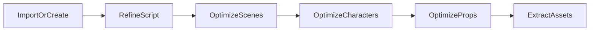

# 剧本工程功能 — 概要设计

## 1. 文档目的与范围

本文档描述「剧本工程」模块在**导入剧本**、**历史版本**、**剧本预览**以及**三阶段智能体优化**（场景 / 角色 / 道具）方面的目标架构、数据模型、接口与流水线，与 [开发文档](./开发文档.md) 中的任务拆分与验收标准配套使用。

**范围**：后端 `aigc-server`、前端 `aigc-site-react`；不包含 PDF 导入等非 MVP 能力（见第 8 节后续迭代）。

---

## 2. 术语

| 术语 | 说明 |
|------|------|
| 原始剧本 | 用户粘贴或上传解析后的纯文本，对应存储为 `ORIGINAL` 文档版本 |
| 完善剧本（refine） | 单次 LLM 将原始剧本结构化为 JSON（含 `scenes`、`segments`、`characters`、`props` 等）并生成 Markdown 摘要稿 |
| 三阶段优化（optimize） | 在 refine 结果之上，分三次 LLM 调用分别强化**场次与拍摄向信息**、**角色人设**、**道具创意**，写回结构化 JSON |
| 资产抽取 | 将结构化 JSON 中的条目映射为 `ExtractedAsset`，**不再次调用 LLM**（与 optimize 区分） |
| 修订快照（revision） | 在覆盖「当前完善稿」前，将当时的 Markdown + JSON 文件复制到归档路径并记录元数据，支持列表与恢复 |

---

## 3. 现状与增量

### 3.1 已有能力（基线）

- 创建项目：`POST /api/v1/script-projects`（文本）、`POST /api/v1/script-projects/upload`（`.txt`/`.md`/`.docx`）。
- 完善剧本：`POST /api/v1/script-projects/{id}/refine`，提示词见 `prompts/script/refine-*.md`。
- 读/写剧本：`GET/PUT .../script`。
- `ScriptDocumentVersion` 与 `replaceDocumentVersion`：**同 `DocumentVersionType` 仅保留一条**，不构成完整历史链。

### 3.2 本设计增量

1. **导入到已有项目**：在不新建项目的前提下替换或追加原始剧本文本（可选触发 refine）。
2. **修订历史**：`ScriptRevision` 列表，支持列表与恢复到当前工作副本（恢复操作再记一条新修订）。
3. **预览增强**：结构化数据以**场景时间线、角色卡、道具表**呈现，而非仅原始 JSON 字符串。
4. **三智能体优化**：独立 REST 与 `prompts/script/optimize-*` 提示词，顺序建议为 **场景 → 角色 → 道具**。

---

## 4. 业务流水线

- **第一层（refine）**：保证全局 JSON schema 与 ID 引用一致（与 `refine-system.md` 一致）。
- **第二层（optimize）**：在不变更顶层 `id` 的前提下，**按 id 合并**增强字段（见第 5.2 节）。
- **与资产抽取**：仅当结构化 JSON 含所需字段后，再调用现有 `POST .../assets/extract/{type}`。

---

## 5. 数据模型

### 5.1 `ScriptRevision`（修订快照）

| 字段 | 类型 | 说明 |
|------|------|------|
| revisionId | String | 唯一标识（如 `rev-...`） |
| revisionIndex | int | 从 1 递增，便于展示 |
| label | String | 简短说明，如 `before-refine`、`before-optimize-scenes` |
| kind | String 枚举 | 见下表 |
| createdAt | Instant | 创建时间 |
| refinedMarkdownFileId | String \| null | 快照 Markdown 文件 |
| refinedJsonFileId | String \| null | 快照 JSON 文件 |

**RevisionKind（示例）**：`REFINE`、`USER_EDIT`、`OPTIMIZE_SCENE`、`OPTIMIZE_CHARACTER`、`OPTIMIZE_PROP`、`RESTORE`、`IMPORT`、`BEFORE_UPDATE`。

**存储**：`ScriptProjectAggregate.revisions` 追加列表；快照文件存放在 `documents/revisions/{revisionId}.md` / `.json`，避免覆盖当前 `documents/refined-script.*`。

**恢复策略**：读取某条修订的文件内容，作为**新的**当前 `refined-script.md` / `refined-script.json` 写入；写入前对**当前**内容再拍一条快照（便于撤销恢复）。

### 5.2 `structuredScript` 扩展字段（合并约定）

在 refine 产出的 JSON 基础上，optimize 阶段**按元素 id 合并**：

**scenes[] / segments[]**（场景优化智能体）

| 字段 | 说明 |
|------|------|
| shootingNotes | 拍摄/调度备注 |
| blocking | 站位与走位简述 |
| estimatedDurationSec | 估算镜头时长（秒，可选） |

**characters[]**（角色人设智能体）

| 字段 | 说明 |
|------|------|
| persona | 一句话人设 |
| traits | 性格标签数组 |
| quirks | 记忆点/趣味细节 |
| relationships | 对象或数组，与其他角色关系 |

**props[]**（道具创意智能体）

| 字段 | 说明 |
|------|------|
| creativeUse | 剧情巧思用法 |
| sceneRefs | 关联场景 id 列表 |
| importance | 叙事重要性说明 |

**向后兼容**：`extractAssets` 仍以 `id`、`name`、`description`、`tags` 为主；新增字段写入 `ExtractedAsset.metadata`（已有模式）。

---

## 6. 接口概要

| 能力 | 方法 | 路径 |
|------|------|------|
| 导入到已有项目 | POST | `/api/v1/script-projects/{id}/import` |
| 修订列表 | GET | `/api/v1/script-projects/{id}/revisions` |
| 恢复修订 | POST | `/api/v1/script-projects/{id}/revisions/{revisionId}/restore` |
| 场景优化 | POST | `/api/v1/script-projects/{id}/optimize/scenes` |
| 角色优化 | POST | `/api/v1/script-projects/{id}/optimize/characters` |
| 道具优化 | POST | `/api/v1/script-projects/{id}/optimize/props` |

统一响应封装仍为 `ApiResponse<T>`（`code=200` 表示成功）。错误码约定见 [开发文档](./开发文档.md)。

---

## 7. 非功能需求

- **长文本**：optimize 输入为结构化 JSON 子集 + 原文摘要，控制单次 token；必要时后续可分段（非 MVP）。
- **JSON 解析失败**：返回 502，并保留失败上下文文件（与 refine 失败路径一致）。
- **存储**：修订仅增加引用文件，可配置保留策略（如按数量裁剪旧修订，**后续迭代**）。

---

## 8. 后续迭代（非 MVP）

- PDF / Fountain 等格式导入。
- 修订 diff 视图与两版本并排对比。
- `POST .../optimize` 一次性提交 `steps` 数组与异步任务队列。

---

## 9. 参考代码路径

| 模块 | 路径 |
|------|------|
| 剧本工程聚合 | `aigc-server/.../entity/ScriptProjectAggregate.java` |
| 完善流水线 | `aigc-server/.../service/ScriptWorkflowService.java` |
| 提示词 | `aigc-server/src/main/resources/prompts/script/` |
| 前端预览页 | `aigc-site-react/src/pages/ScriptProjectPreviewPage.tsx` |
