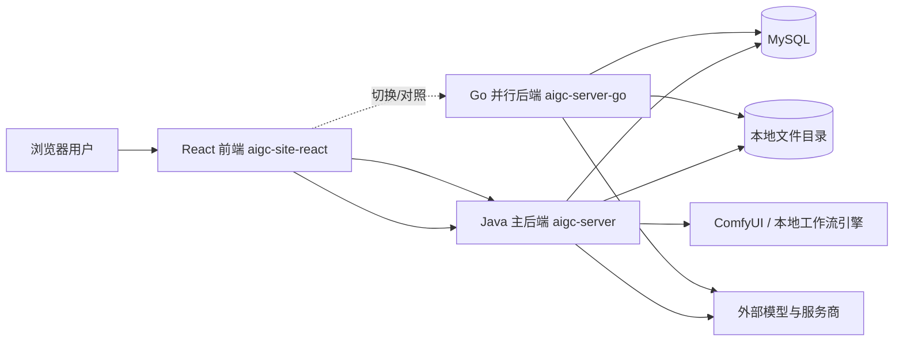

# 项目架构

## 1. 文档目的

本文档基于当前仓库中的代码与已有设计文档，说明本项目的主线技术栈、系统边界、前后端职责、核心模块、主要数据流与外部依赖，供开发、联调和验收时快速建立统一认知。

本文描述的是“当前实现状态”，不是未来规划图。若规划与代码不一致，以代码为准。

---

## 2. 项目总体定位

该项目是一个面向高校 AIGC 实训场景的应用，核心目标不是单一的“文生图”工具，而是把以下几类能力组合到同一平台内：

- 通用创作工作台：发起文本、图像、视频生成任务，查看历史与结果。
- 剧本工程工作流：从剧本导入、完善、结构化、资产抽取、关键帧、镜头拆分，到视频生成、配音、口型、剪辑与导出。
- 教学实训管理：课程、作业、提交、审核、运营看板。
- 模型与服务商治理：连接配置、模型配置、路由优先级、提示词模板覆盖。

从当前代码结构看，系统主线由 `aigc-site-react` 前端和 `aigc-server` Java 后端承载；`aigc-server-go` 是一套与 Java 后端并行对齐、逐步补齐能力的 Go 实现，当前更适合作为迁移/对照后端，而不是唯一主后端。

---

## 3. 主线技术栈

### 3.1 前端

- 框架：React 19
- 构建：Vite 8
- 语言：TypeScript 5
- 路由：React Router 7
- 状态管理：Zustand
- 网络层：Axios
- 画布能力：`@comfyorg/litegraph`

前端代码位于 `aigc-site-react`，采用单页应用模式，通过路由划分工作台、剧本工程、教学、治理与设置等页面。

### 3.2 主后端

- 语言：Java 17
- 框架：Spring Boot 3.5
- Web：Spring MVC
- 校验：Spring Validation
- 数据访问：Spring Data JPA
- 数据库迁移：Flyway
- 数据库：MySQL
- 鉴权与密码/令牌处理：Spring Security Crypto + JWT
- 文档解析：Apache POI（用于 `.docx` 剧本导入）

主后端代码位于 `aigc-server`，承担当前最完整的业务实现。

### 3.3 并行后端

- 语言：Go 1.22
- Web：Gin
- ORM：GORM
- 数据库：MySQL
- OAuth：`golang.org/x/oauth2`

Go 代码位于 `aigc-server-go`。它已实现健康检查、生成主路径、部分配置与文件服务，并通过运行说明文档明确与 Java 后端并行对照、共享 MySQL 与数据目录。

### 3.4 存储与资源

- 结构化业务数据主存储：MySQL
- 文件与中间产物：本地文件目录 `AIGC_DATA_DIR`
- 脚本工程文件：原始剧本、完善稿、结构化 JSON、关键帧、分镜图、视频、导出包等

从代码看，项目既保留了本地 JSON 文件仓库实现，也已经默认启用了 JPA 仓库作为主实现；因此当前更准确的表述是“数据库为主、文件为辅”。

---

## 4. 系统边界

### 4.1 逻辑边界总览

### 4.2 系统内部边界

- 浏览器端只负责界面呈现、表单输入、状态轮询、流程编排和权限表现层，不直接访问数据库或模型服务。
- Java 后端负责业务主流程、权限校验、项目聚合持久化、任务编排、外部模型调用、审核与教学规则。
- Go 后端负责与 Java 对齐的替代实现，当前属于迁移/并行验收边界。
- MySQL 承载主业务实体和聚合数据。
- 本地文件目录承载项目资源文件与生成结果。
- 外部模型服务负责真正的文本、图像、视频、TTS 等能力生成，不承载业务状态。
- ComfyUI 通过代理方式接入，属于外部执行引擎，不直接承担平台业务模型。

### 4.3 不在本文主线范围内的内容

- 仓库中的 `ComfyUI-0.19.1` 更像外部引擎源码或内置依赖，不属于平台业务主域代码。
- 一些规划文档描述了未来能力扩展，但不应被视为当前已上线架构。

---

## 5. 前后端职责划分

### 5.1 前端职责

前端以页面路由和 Zustand Store 为核心，职责包括：

- 页面导航与壳层统一：主页、工作台、课程、剧本工程、后台治理等入口统一由路由配置驱动。
- API 编排：通过统一 `api/index.ts` 调用后端接口，附加鉴权头、错误处理、数据归一化。
- 流程型交互：剧本工程的预览、资产、视频、配音、口型、剪辑、导出等页面串起完整工作流。
- 客户端状态管理：`scriptProjectStore`、`generationStore`、`authStore` 等管理项目详情、轮询状态、用户登录态与页面联动。
- 兼容无后端场景的局部 mock：当未配置 `VITE_API_BASE_URL` 时，部分通用工作台能力可退化到本地存储 mock。

前端不负责：

- 模型选路决策
- 权限最终裁决
- 任务落盘与恢复
- 外部模型协议适配

### 5.2 后端职责

Java 主后端职责包括：

- 认证鉴权：校验 JWT、开发态 token、用户启停状态与角色。
- 业务域服务：剧本工程、教学课程、作业提交、资源中心、审计、审核等。
- 聚合持久化：维护项目聚合及其子表/子集合。
- 工作流编排：剧本完善、优化、资产抽取、关键帧生成、镜头拆分、视频流水线、剪辑与导出。
- 模型治理：连接配置、模型配置、路由优先级、探测与服务商抽象。
- 文件服务：将项目文件统一暴露为可访问的 `/api/v1/files/*` 资源。
- 对外能力代理：将上层业务请求转换为对外部模型与 ComfyUI 的调用。

Go 后端当前职责更偏：

- 对 Java 既有 API 的平行实现
- 迁移验证和接口对照
- 部分模块的替代运行

---

## 6. 核心模块

### 6.1 创作工作台模块

这是最基础的 AIGC 入口，覆盖：

- `text`
- `image`
- `video`
- `both`

对应能力包括：

- 发起生成任务
- 查询历史记录
- 查看单任务详情
- 删除任务
- 查询图像/视频模型选项

这条链路偏“单次生成”，适合快速试跑和基础创作。

### 6.2 剧本工程模块

这是当前平台最核心的生产域，围绕 `ScriptProjectAggregate` 展开。它把一个项目需要的对象统一挂到同一聚合下，包括：

- 项目信息
- 剧本文档版本
- 修订历史
- 文件记录
- 资产
- 关键帧
- 镜头
- 视频任务
- 配音任务
- 口型任务
- 剪辑草稿与渲染任务
- 成片任务
- 导出包任务
- 流水线运行记录

该模块支撑完整的“剧本到视频”过程，是系统架构的主心骨。

### 6.3 资产与关键帧模块

该模块负责把剧本中的结构化信息进一步转为可生产的视频素材，包括：

- 角色 / 背景 / 道具抽取
- 视觉提示词生成
- 三视图 / 九宫格 / 分组场景图
- 关键帧生成、确认与回滚
- 历史快照记录

它位于“剧本理解”和“视频生产”之间，是典型的中间层。

### 6.4 视频生产与后处理模块

该模块负责把镜头与素材变成真正的视频结果，包含：

- 镜头拆分
- 视频分段生成
- 重试与轮询
- 配音生成
- 口型同步
- 视频编辑草稿
- 预览渲染
- 发布成片
- 导出包生成
- 内容审核状态衔接

它是最强的异步任务编排模块，也是与外部视频模型耦合最深的部分。

### 6.5 教学实训模块

该模块面向高校使用场景，覆盖：

- 课程管理
- 作业管理
- 学生提交
- 审核与评分
- 项目与课程绑定

它把“项目生产”纳入课程与作业上下文，而不是让剧本工程独立漂浮。

### 6.6 组织治理与运营模块

该模块支撑平台后台治理，包含：

- 组织与用户目录
- 登录与会话
- 审计日志
- 运营看板
- 资源中心
- 模型与服务商中心
- 提示词模板与覆盖

它不是生成链路本身，但决定系统是否可以作为可管理平台交付。

---

## 7. 主要数据与存储模型

### 7.1 业务数据

主后端已使用 JPA + MySQL 保存核心实体。按聚合视角看，最重要的对象是 `ScriptProjectAggregate`，其子对象通过多张表或子记录集合保存。

### 7.2 文件数据

项目运行会产生大量非结构化文件，例如：

- 上传的剧本文本
- 完善稿 Markdown
- 结构化 JSON
- 分镜图、关键帧、参考图
- 视频分段、口型结果、成片
- 导出包

这些文件由本地文件服务负责落盘，并通过文件记录和 `fileId` 与聚合数据关联。

### 7.3 双存储实现现状

仓库中同时存在两种 `ScriptProjectRepository` 实现：

- 文件仓库：按 `script-projects/{projectId}/project.json` 保存聚合
- JPA 仓库：将聚合拆成项目表和多类子表保存

当前 JPA 实现带有 `@Primary`，因此 Java 主后端默认使用 MySQL 持久化；文件仓库更多用于早期版本或本地持久化兜底思路。

---

## 8. 主要数据流

### 8.1 数据流一：通用工作台生成

1. 用户在前端工作台输入提示词、模式与模型参数。
2. 前端调用 `/api/v1/generate`。
3. 后端基于用户身份、模型配置和路由规则选择合适连接。
4. 后端调用外部文本/图像/视频模型。
5. 后端保存任务结果与文件引用。
6. 前端通过历史与详情接口展示结果。

这条数据流强调“快速生成”和“单任务闭环”。

### 8.2 数据流二：剧本工程主生产链路

1. 用户创建剧本工程，或上传剧本文件导入工程。
2. 后端解析原始文本并建立项目聚合。
3. 用户触发 refine，后端调用文本模型生成完善稿与结构化 JSON。
4. 用户继续触发 optimize scenes / characters / props，后端分阶段增强结构化数据。
5. 后端从结构化数据抽取人物、背景、道具等资产。
6. 用户或系统生成视觉提示词、三视图、九宫格与关键帧。
7. 后端拆分镜头，形成视频任务。
8. 后端并发调用外部视频模型并轮询状态。
9. 用户继续发起配音、口型、剪辑预览、正式发布与导出。
10. 最终视频文件与导出包进入项目文件集，前端在项目子页面中统一查看。

这条数据流体现了系统从“内容理解”到“素材准备”再到“成片交付”的完整生产链。

### 8.3 数据流三：教学提交与审核

1. 教师创建课程和作业。
2. 学生在课程上下文中创建或绑定剧本工程。
3. 学生提交项目到作业。
4. 后端校验课程归属、截止时间、权限与项目状态。
5. 教师查看提交、审核内容、给出意见或评分。
6. 运营端可在看板与审计日志中汇总项目、提交和导出状态。

这条数据流体现了“创作平台”和“教学平台”的融合。

### 8.4 数据流四：模型与连接治理

1. 管理员配置连接信息、API Key 与 provider 元数据。
2. 管理员配置模型，并声明其能力类型。
3. 路由服务按优先级、启用状态和容灾规则解析可用连接。
4. 生成类服务在实际请求时读取这些配置，选择目标 provider 发起调用。

这使得业务层不必写死某个外部模型供应商。

---

## 9. 外部依赖

### 9.1 模型服务商与云能力

从代码和配置中可以确认，系统已经接入或预留了以下外部依赖能力：

- 火山引擎 Ark：默认图像/视频模型入口之一
- AWS Bedrock：Java 与 Go 均保留相关网关能力
- Google Vertex AI：Go 网关已实现 OAuth + 调用逻辑
- OneLinkAI：配置中提供独立开关与模型列表能力
- 其他兼容 HTTP provider：通过 Provider Catalog / 路由层抽象接入

### 9.2 本地或自部署能力

- ComfyUI：通过 `/api/comfy/**` 代理方式接入，默认目标地址为本地 `8188`
- 本地文件系统：保存项目资源与生成结果
- MySQL：主业务数据库

### 9.3 前端运行依赖

- 浏览器本地存储：保存访问令牌、客户端用户标识、部分 mock 数据和剪辑草稿缓存

---

## 10. 当前架构特点与约束

### 10.1 特点

- 单仓库聚合多端代码，便于统一交付。
- Java 主后端业务完整度高，已经形成面向平台的业务域。
- 剧本工程采用项目聚合思路，适合承载复杂多阶段流水线。
- 模型接入层做了 provider 抽象，业务域不直接写死厂商协议。
- 前端路由已将工作台、项目、教学和后台治理统一到一套 SPA 中。

### 10.2 约束

- 剧本工程聚合较大，JPA 保存策略当前采用“整聚合删旧再写入子表”的方式，简单但会放大写入成本。
- 视频、配音、口型、剪辑等链路都依赖外部服务可用性，系统本质上是编排层，不是算力执行层。
- Go 后端仍处于并行对照阶段，不能默认视为所有业务都已与 Java 完全等价。
- 文件存储当前以本地目录为主，更适合单机或轻量部署。

---

## 11. 结论

当前项目可以概括为：

- 一个以 React 为统一入口的高校 AIGC 实训前端；
- 一个以 Spring Boot 为主实现的业务后端；
- 一个用于迁移和并行验证的 Go 后端；
- 一套以 MySQL + 本地文件目录保存状态和资源的存储方案；
- 一层面向多服务商模型与 ComfyUI 的外部能力编排层。

如果只抓主线，可以把它理解为“围绕剧本工程构建的高校 AIGC 视频生产与教学平台”，而不是单纯的图片/视频生成 Demo。
